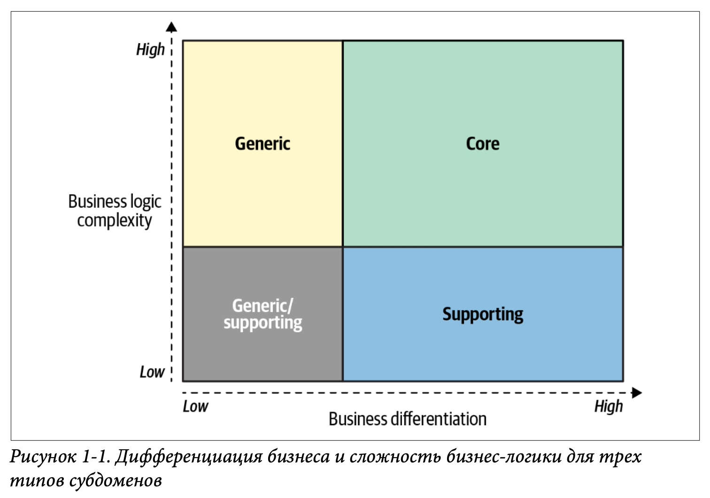
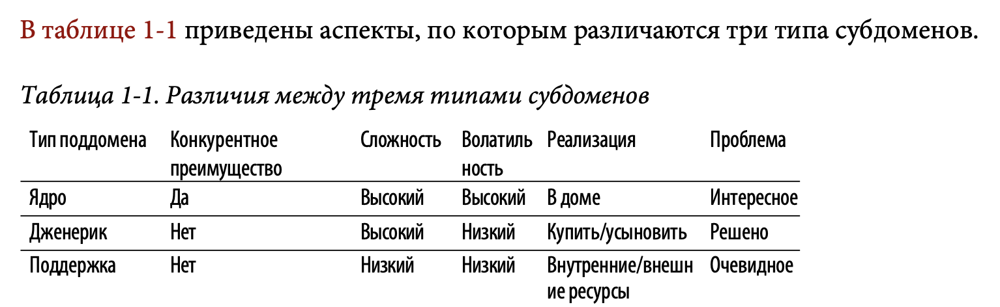
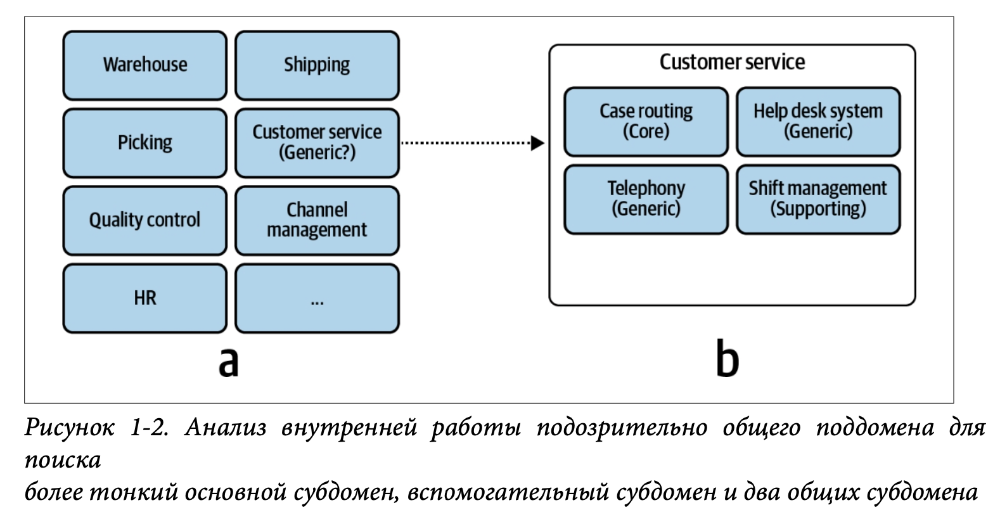
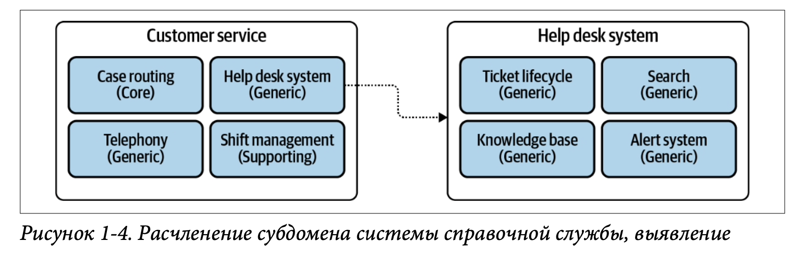

---
# You can also start simply with 'default'
theme: seriph
# random image from a curated Unsplash collection by Anthony
# like them? see https://unsplash.com/collections/94734566/slidev
background: https://cover.sli.dev
# some information about your slides (markdown enabled)
title: DDD learning
info: |
  ## Slidev Starter Template
  Presentation slides for developers.

  Learn more at [Sli.dev](https://sli.dev)
# apply unocss classes to the current slide
class: text-center
# https://sli.dev/features/drawing
drawings:
  persist: false
# slide transition: https://sli.dev/guide/animations.html#slide-transitions
transition: slide-left
# enable MDC Syntax: https://sli.dev/features/mdc
mdc: true
---

# DDD learning

---

# Анализ бизнес доменов

## Что такое бизнес домен?

- FedEx - обеспечивает доставку посылок
- Starbucks - известная сеть кофеен
- Walmart - самая известная розничная сеть в мире

Компания может заниматься несколькими бизнес доменами одновременно.
Например Amazon - онлайн магазин, облачные сервисы, стриминговый сервис.

--- 

## Что такое субдомен?

> Поддомен - это тонкая область бизнеса, которая может быть выделена в отдельный продукт или сервис.

---

## Типы субдоменов

- **Core Domain** - это ключевой субдомен, который отличает вашу компанию от конкурентов.
- **Supporting Subdomain** - это субдомен, который не является ключевым, но обеспечивает работу Core Domain.
- **Generic Subdomain** - это субдомен, который не является ключевым и не обеспечивает работу Core Domain (Auth/Sentry).

---

## Core Domain

- **Ключевой субдомен** - это тот, который отличает вашу компанию от конкурентов.

---

## Supporting Subdomain

- **Поддерживающий субдомен** - это субдомен, который не является ключевым, но обеспечивает работу Core Domain.
- Примеры: Payment, Shipping, Notification.

---

## Generic Subdomain

- **Общий субдомен** - это субдомен, который не является ключевым и не обеспечивает работу Core Domain.
- Примеры: Auth, Sentry, Logging, Monitoring.

---

## Сравнение субдоменов

---

## Определение границ субдоменов

На примере интернет-магазина (по отделам):
- склад
- отдел обслуживания клиентов
- отдел комплектации заказов
- отдел доставки
- отдел маркетинга
- отдел контроля качества
- отдел управления персоналом

---

## Определение границ субдоменов

---

## Примеры анализа бизнес доменов

---

## Gimaster

---

## BusVNext

---

## Кто такие эксперты по доменнам?

---

## Summary

---

## Упражнения

---