---
# You can also start simply with 'default'
theme: seriph
# random image from a curated Unsplash collection by Anthony
# like them? see https://unsplash.com/collections/94734566/slidev
background: https://cover.sli.dev
# some information about your slides (markdown enabled)
title: Welcome to Slidev
info: |
  ## Slidev Starter Template
  Presentation slides for developers.

  Learn more at [Sli.dev](https://sli.dev)
# apply unocss classes to the current slide
class: text-center
# https://sli.dev/features/drawing
drawings:
  persist: false
# slide transition: https://sli.dev/guide/animations.html#slide-transitions
transition: slide-left
# enable MDC Syntax: https://sli.dev/features/mdc
mdc: true
---

# DDD Learning: Part 2

---

## Экспертные знания о предметной области

 

- единый язык (ubiquitous language)
- Задачи бизнеса (business problems)
- Выявление экспертных знаний (domain experts)

  

> Бизнес-задачей могут быть оптимизация рабочих процессов, минимизация ручного труда, управление ресурсами, поддержка принятия решений, управление данными и т. д.

  

> Эффективность решения зависит от того, насколько хорошо разработчик понимает способ мышления эксперта и его ментальную модель.
> Эффективный обмен знаниями между экспертами в предметной области и разработчиками программного продукта требует продуктивного общения.

---

### Общение

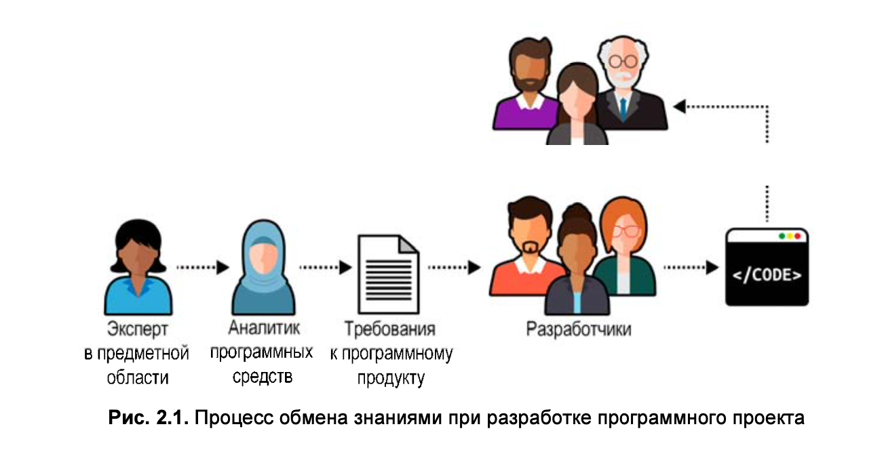

> Такой процесс разработки программного продукта напоминает детскую игру «Ис- порченный телефон»2: информация о предметной области зачастую искажается.

Предметно-ориентированное программирование предлагает более эффективный способ передачи знаний от экспертов предметной области к программистам: использование единого языка (ubiquitous language)

---

### Что такое единый язык?

- единый язык — это язык бизнеса
- не должно быть никакого технического жаргона
- каждое понятие единого языка должно иметь одно-единственное значение (Согласованность)

---

### Модель предметной области

> Модель — это упрощенное представление вещи или явления, в котором намеренно подчеркиваются одни аспекты и игнорируются другие. Это абстракция с учетом конкретного использования.
> _Ребекка Вирфс-Брок (Rebecca Wirfs-Brock)_

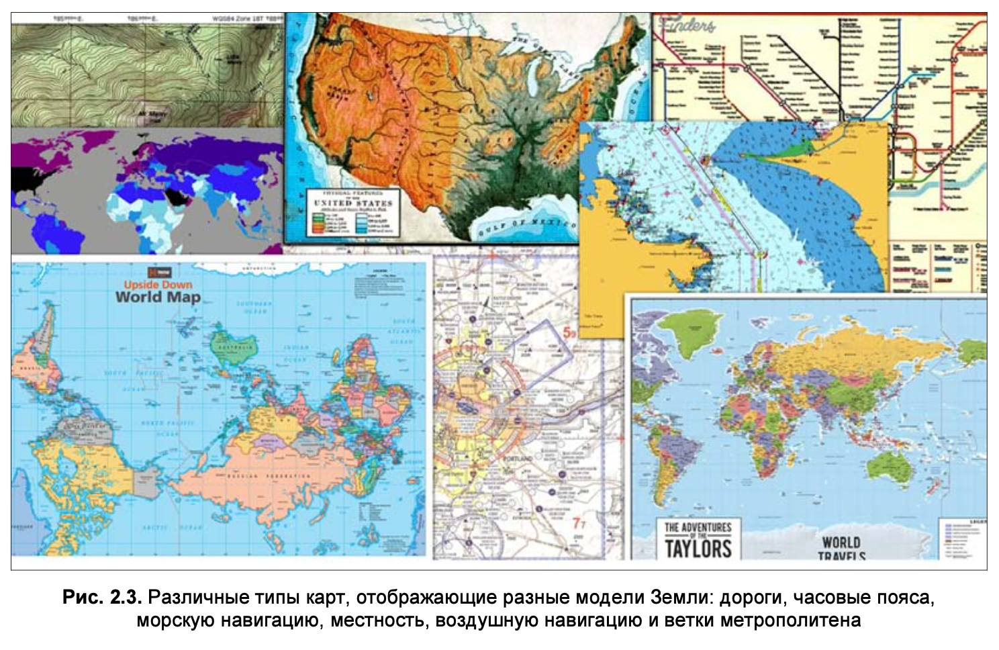

> Ни одна из этих карт не предоставляет всех подробностей нашей планеты. Каждая содержит ровно столько данных, сколько необходимо для ее конкретной цели: той задачи, для решения которой она создана.

---

### Инструменты

- Глоссарии - список терминов и их определений
- Автоматизированные тесты, написанные на языке Gherkin
- инструменты статического анализа кода
- Agile: Люди и взаимодействие важнее процессов и инструментов

---

### Выводы

- общение и обмен знаниями - это важно для успешной разработки программного продукта
- Чтобы общение было плодотворным, единый язык должен устранять неопределенности и скрытые предположения
- Развитие единого языка — непрерывный процесс

---

## Глава 3: Как осмыслить сложность предметной области

---

### Противоречивые модели

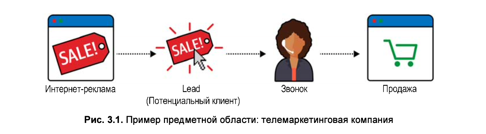

Термин «lead» в отделах маркетинга и продаж имеет разные значения:

- в отделе маркетинга — это потенциальный клиент (потенциальный покупатель)
- в отделе продаж — весь жизненный цикл процесса продажи (от первого контакта до заключения сделки)

---

#### Решение

- Единый язык в рамках предприятия
  - Нужны префиксы: marketing_lead, sales_lead (никто не будет это использовать в общении)
  - Сложно поддерживать
  - Много пересечений
- Язык в рамках отдела (ограниченный контекст)
  - Префиксы не нужны
  - Проще поддерживать
  - Меньше пересечений

---

### Ограниченный контекст

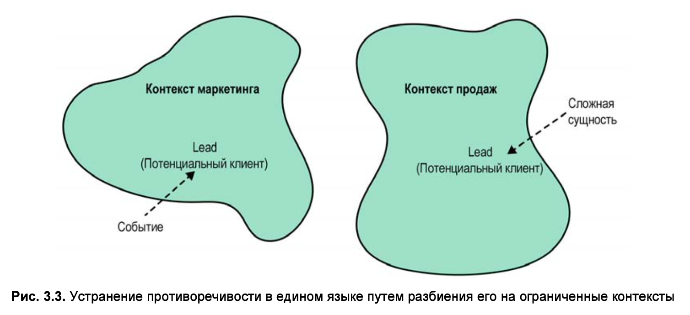

- Границы модели (bounded context) — это области, в которых определены термины и их значения
- единый язык в рамках ограниченного контекста

---

### Область применения ограниченного контекста

> модели можно разбить на еще более мелкие ограниченные контексты.

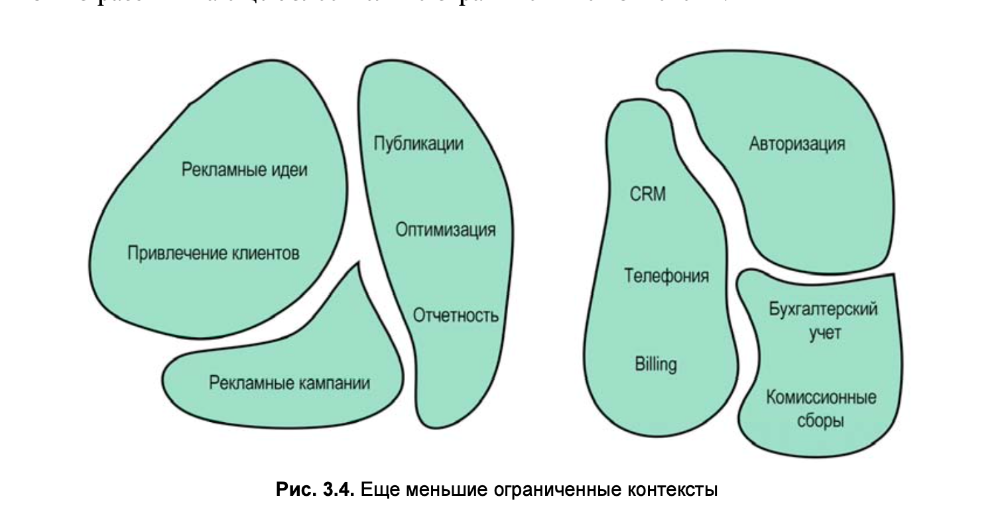

---

### Сравнение ограниченных контекстов и поддоменов

 

- Поддомены (основных (core), универсальных (generic) и вспомогательных (supporting))
- Ограниченные контексты (ограниченные контексты определяются в процессе проектирования)

 
 

> Проектировщики решают, как разбить предметную область (business domain) на более мелкие, управляемые области задач (problem domains).

---

### Взаимодействие поддоменов и ограниченных контекстов

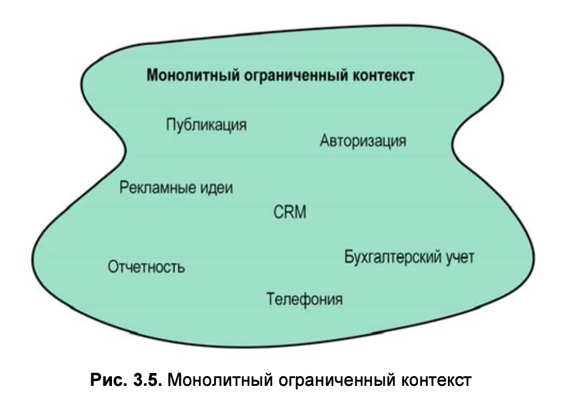

> Если модели все еще слишком большие и их трудно поддерживать, можно разбить их на еще более мелкие ограниченные контексты

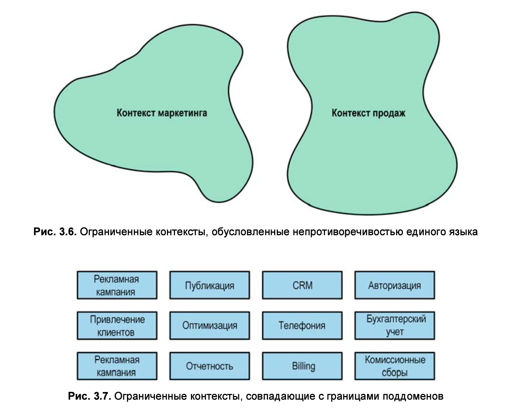

---

### Границы

- **Физические границы** - ограниченный контекст должен быть реализован как отдельный сервис или проект
- **Границы владения** - Никакие две команды не могут работать над одним и тем же ограниченным контекстом

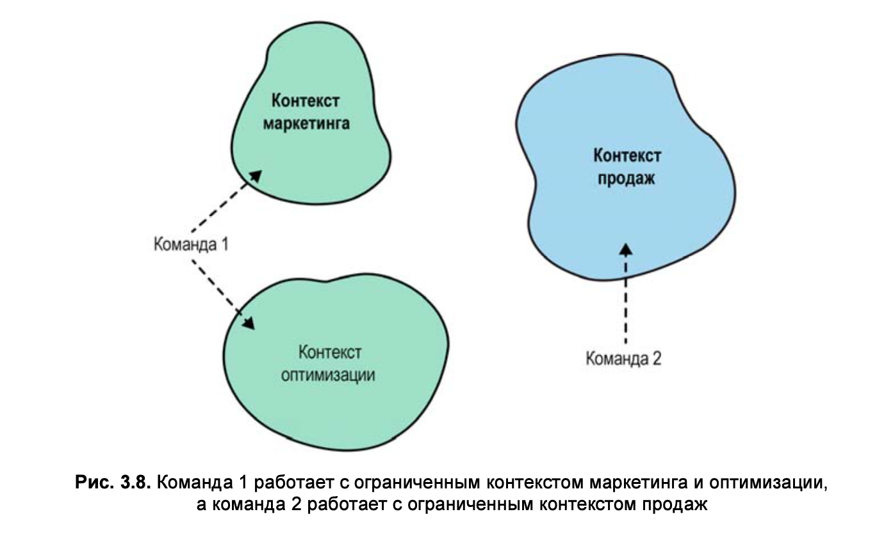

---

### Пример модели - Покупка холодильника

---

### Пример модели - Покупка холодильника

---

### Выводы

- Единый язык в рамках своего ограниченного контекста должен быть непротиворечивым
- Разбиение предметной области на ограниченные контексты является стратегическим проектным решением
- Ограниченный контекст и его единый язык могут реализовываться и поддерживаться одной командой
- Ограниченные контексты разбивают систему на физические компоненты — сервисы, подсистемы и т.д

---

## Глава 4: Интеграция ограниченных контекстов

_Ограниченный контекст_ (**Bounded Context**) защищает согласованность единого языка (**Ubiquitous Language**) внутри своих границ 
и открывает возможности к построению моделей. 

> Построить модель, не определив цель ее существования, 
т.е. не зафиксировав ее границы, невозможно. Эта граница — граница ответственностей языков, 
она означает, что одни и те же бизнес-сущности в разных ограниченных контекстах могут использоваться 
для решения различных задач.

---

### Сотрудничество (Cooperation)

Паттерны сотрудничества (cooperation) относятся к ограниченным контекстам (bounded context), реализованным командами 
с хорошо налаженным взаимодействием.

- **Партнерство** (Partnership)
- **Общее ядро** (shared kernel)

---

### Партнерство

В партнерской (**partnership**) модели интеграция ограниченных контекстов координируется по ситуации. 
Одна команда может уведомить вторую команду об изменении API, а вторая команда адаптируется к нему в духе сотрудничества — без драм и конфликтов

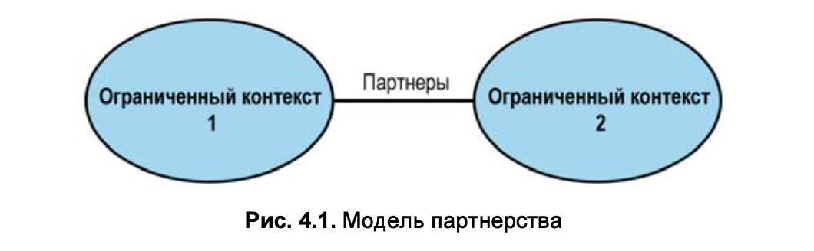

---

### Общее ядро

Здесь крайне важно отметить, что общая модель разрабатывается в соответствии с потребностями всех ограниченных контекстов.

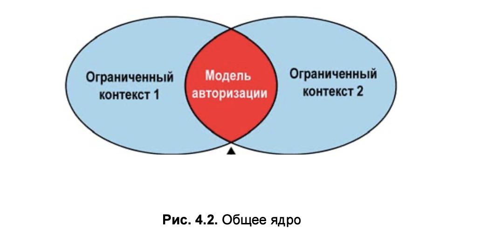

Модель с перекрытием, используемая в нескольких ограниченных контекстах, связывает жизненные циклы.
В идеале общее ядро (shared kernel) будет состоять только из интеграционных контрактов и структур данных, предназначенных для передачи данных через границы ограниченных контекстов.

---

##### Когда следует воспользоваться общим ядром

- Избежать дублирования логики и снизить затраты на поддержку
- постепенная модернизация устаревшей системы
- для интеграции ограниченных контекстов, принадлежащих и реализуемых одной и той же командой

---

### Потребитель-Поставщик (Customer-supplier)

Поставщик (supplier), предоставляет услуги своим потребителям (customer). 
Поставщик услуг находится «выше по течению», а клиент или потребитель — «ниже по течению».

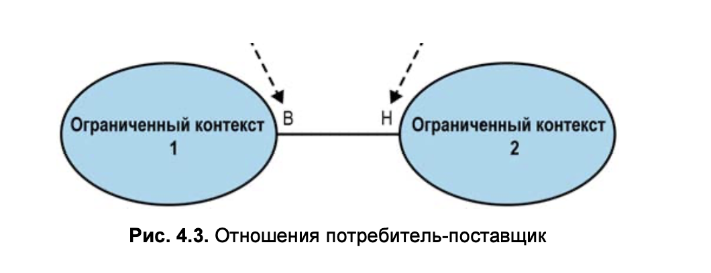

- **конформист** (conformist)
- **предохранительный слой** (anticorruption layer)
- **сервис с открытым протоколом** (open-host service)

---

### Конформист (Conformist)

В ряде случаев при сложившемся балансе сил предпочтение отдается вышестоящей (upstream) команде, у которой нет 
никакой реальной мотивации поддерживать потребности своих клиентов. Вместо этого она просто предоставляет интеграционный контракт, 
определенный в соответствии со своей собственной моделью по принципу «хочешь принимай, хочешь не принимай». 

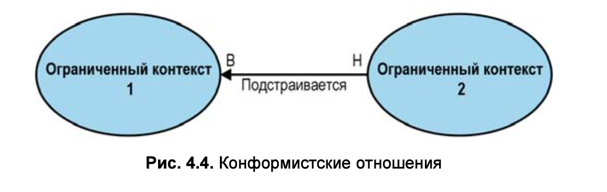

> Такой дисбаланс сил может быть вызван интеграцией с внешними по отношению к организации поставщиками услуг, 
или же просто сложившейся политикой организации.

---

### Предохранительный слой (Anticorruption Layer)

Предохранительный слой (**Anticorruption Layer**) предназначен для тех сценариев, когда прилагать усилия для подстройки 
под модель поставщика нежелательно или нецелесообразно

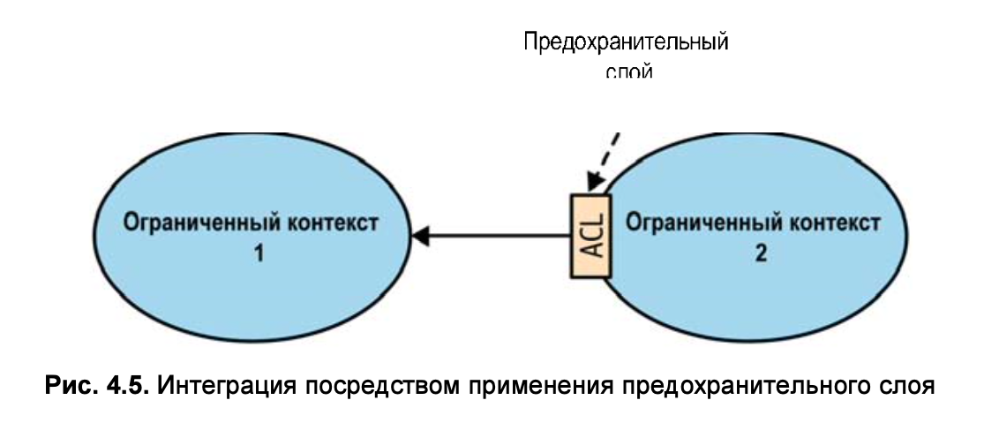

- Когда нисходящий (downstream) ограниченный контекст содержит основной поддомен (core subdomain)
- Когда восходящая (upstream) модель неэффективна или не соответствует нуждам потребителя
- Когда контракт поставщика меняется слишком часто

---

### Сервис с открытым протоколом (Open-host Service)

Этот паттерн предназначен для случаев, когда главная роль принадлежит потребителям. 
Поставщик заинтересован в защите своих потребителей и высочайшем качестве их обслуживания.

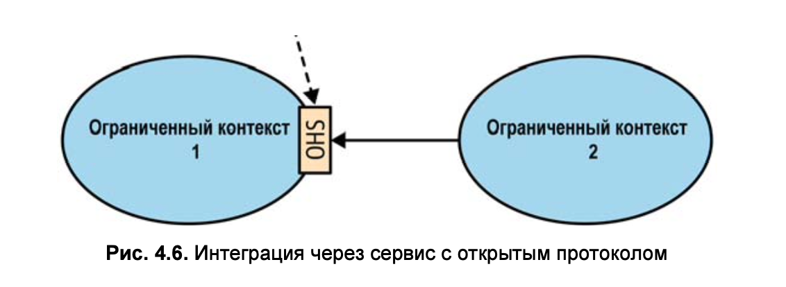
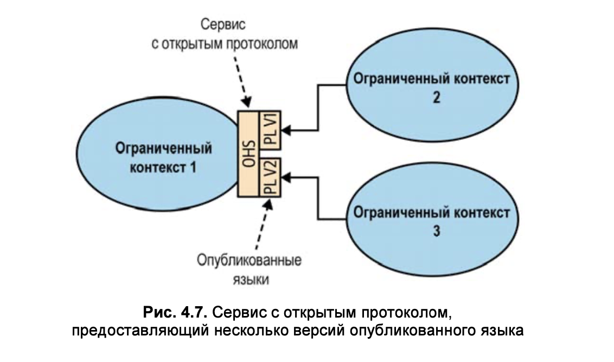

---

### Разные пути (Separate Ways)

Такая линия поведения может возникнуть по разным причинам в тех случаях, когда команды не хотят или не могут сотрудничать.

- Проблемы общения
- Универсальный поддомен (Generic Subdomain) (например логирование)
- Различия в моделях

---

### Карта контекстов (Context Map)

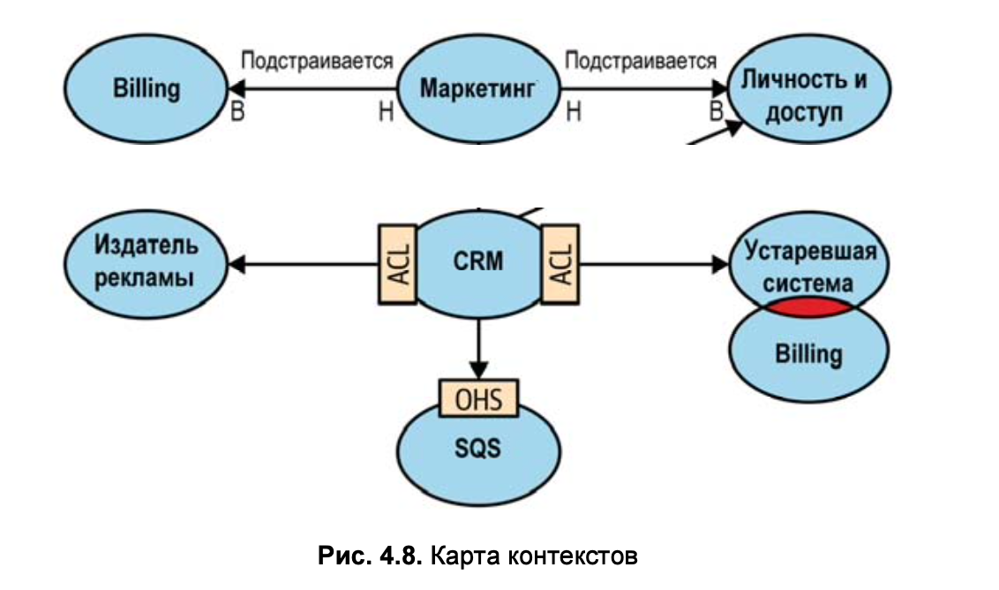

- Высокоуровневое проектирование
- Модели общения
- Организационные вопросы

---

### Поддержка в актуальном состоянии

Карта контекстов может вестись и поддерживаться в виде кода с использованием инструмента, подобного Context Mapper.

- pUML
- Arhimate
