---
# You can also start simply with 'default'
theme: seriph
# random image from a curated Unsplash collection by Anthony
# like them? see https://unsplash.com/collections/94734566/slidev
background: https://cover.sli.dev
# some information about your slides (markdown enabled)
title: Welcome to Slidev
info: |
  ## Slidev Starter Template
  Presentation slides for developers.

  Learn more at [Sli.dev](https://sli.dev)
# apply unocss classes to the current slide
class: text-center
# https://sli.dev/features/drawing
drawings:
  persist: false
# slide transition: https://sli.dev/guide/animations.html#slide-transitions
transition: slide-left
# enable MDC Syntax: https://sli.dev/features/mdc
mdc: true
---

# DDD Learning: Part 3

---

### Тактический замысел vs Стратегическое проектирование

<br />

- **Стратегическое проектирование**:
  - Домены и поддомены (core, support, generic)
  - Контексты (bounded contexts)
  - Общие языки (ubiquitous language)
  - Связи между контекстами (context map)
- **Тактический замысел**:
  - паттерны реализации бизнес-логики (transaction script, active record)
  - модель предметной области (domain model)
  - CQRS (layered architecture)
  - взаимодействия компонентов системы

---

### Реализация простой бизнес-логики

> Транзакционный сценарий

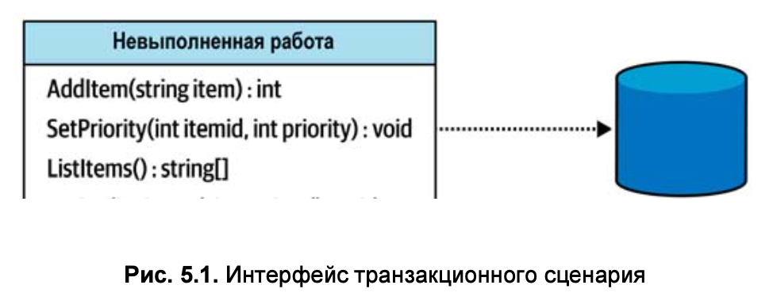

- Каждая операция должна завершаться либо успехом, либо неудачей
- Система должна оставаться согласованной в любой момент времени
  - либо путем отката всех изменений
  - либо путем выполнения компенсирующих действий

---

### Реализация простой бизнес-логики

> Транзакционный сценарий

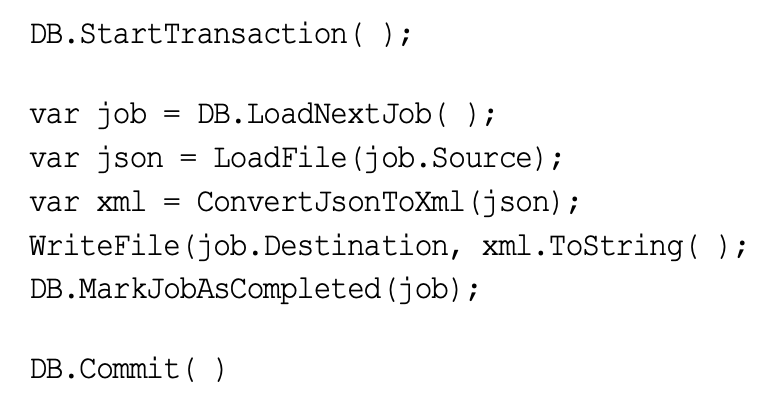

> **Решает проблему**: как обеспечить согласованность данных в системе

<br />

> **Пример**: покупка товара в интернет-магазине (резервирование товара, списание денег, отправка товара)

<br />

> **Пример**: резервирование билета на самолет (бронирование места, списание денег, выписка билета)

---

### Распределенные транзакции

> **Пример**: покупка товара в интернет-магазине (резервирование товара, списание денег, отправка товара)

Тот же самый пример, но теперь за каждое действие отвечает отдельный сервис

#### Неявные распределенные транзакции

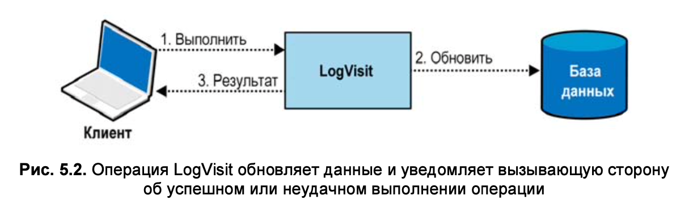

Нет транзакции, но если ошибка произойдет на шаге 3, и сервис повторит 1 действие, то система останется в согласованном состоянии

> **Решение?**:
> - сделать операцию идемпотентной (повторное выполнение не приведет к изменению состояния)
> - оптимистическое обновление (проверка версии/значения перед изменением)

---

### Когда следует применять транзакционный сценарий

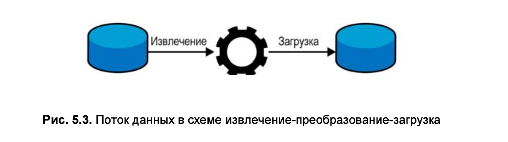

- простые процедурные операции

Минусы:

- при росте сложности операций, сложность кода растет
- дублирование кода

---

### Активная запись (object-relational mapping)

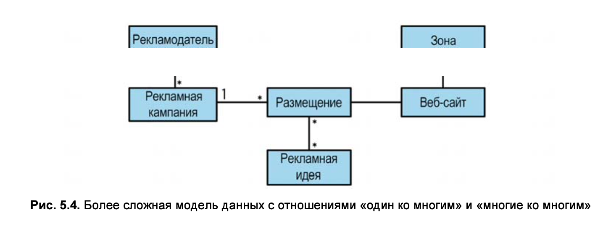


> Цель паттерна — инкапсулировать сложность сопоставления объекта в памяти на схему базы данных

#### Когда следует применять активную запись

- Подходит для сложных данных, простых сценариев
- CRUD-операции
- могут содержать бизнес-логику (валидация, вычисления)

---

### Выводы

- Транзакционный сценарий
- Активная запись

---

### Проработка сложной бизнес-логики. Модель предметной области (доменная модель)

<br />

> Здесь вместо работы с CRUD-операциями решаются вопросы сложных переходов между состояниями, бизнес-правилами и инвариантами

Пример задач:

- Клиенты открывают заявки в службу поддержки, описывая проблемы, с которыми они сталкиваются.
- И клиент, и сотрудник службы поддержки добавляют сообщения
- У каждой заявки есть приоритет: низкий, средний, высокий или срочный
- Передача заявки на рассмотрение в более высокую инстанцию
- SLA-политика: если заявка не решена в течение 24 часов, она автоматически повышается в приоритете
- Заявки автоматически закрываются, если клиент не отвечает
- Эскалированные заявки не могут быть закрыты автоматически

---

#### Модель предметной области (доменная модель)

- агрегаты (aggregates)
- объекты-значения (value objects)
- сущности (entities)
- события предметной области (domain events)
- доменные сервисы (domain services)

<br />

> Акцент на бизнес-логике, а не на технических аспектах упрощает следование объектами модели предметной области понятий 
> единого языка (ubiquitous language) ограниченного контекста (bounded context). 
> Иными словами, этот паттерн позволяет коду «говорить» на едином языке и 
> следовать ментальным моделям экспертов предметной области.

---

### Объект-значение (value object)

<br />

Это объект, который можно идентифицировать по составляющим его значениям

```
class Color {
  int red;
  int green;
  int blue;
}
```

> Можно создать две строки с одинаковыми значениями red, green и blue, но сравнение значений ColorId не покажет, 
> что ими обозначен один и тот же цвет.

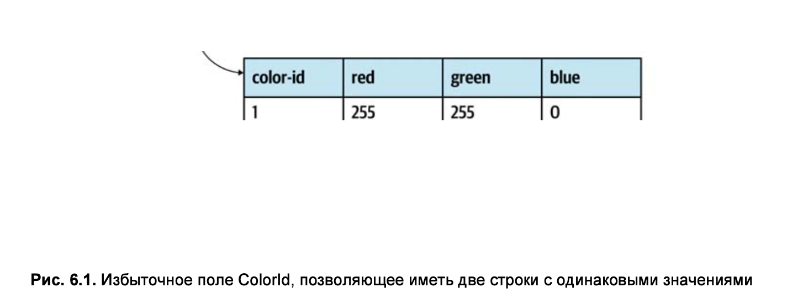

---

### Единый язык. Типы данных

```
class Person {
    String firstName;
    String lastName;
    String email;
    String countryCode;
    String phoneNumber;
    Time birthDate;
}
```

> В показанной выше реализации класса Person большинство значений имеют тип String и присваиваются на основе соглашений.

Проблемы:

- логика проверки часто дублируется
- сложно добавить/изменить правила
- сложно понять, какие правила применяются к каким данным

---

#### Альтернатива: использование объектов-значений

```
class User {
    Name name;
    Email email;
    Country country;
    PhoneNumber phoneNumber;
}
```

Плюсы:

- лучшая читаемость
- не нужно в имя поля добавлять особенности реализации (countryCode -> country)

<hr>

Объект-значение PhoneNumber может инкапсулировать логику анализа строкового значения, его проверки и извлечения различных атрибутов номера телефона: 
например, страны, которой он принадлежит, и типа номера телефона — стационарный или мобильный:

```
var phone = PhoneNumber.Parse("+359877123503");
var country = phone.Country;                        // "BG"
var phoneType = phone.PhoneType;                    // "MOBILE" 
var isValid = PhoneNumber.IsValid("+972120266680"); // false
```

---

### Реализация объекта-значения

- Иммутабельность (неизменяемость)

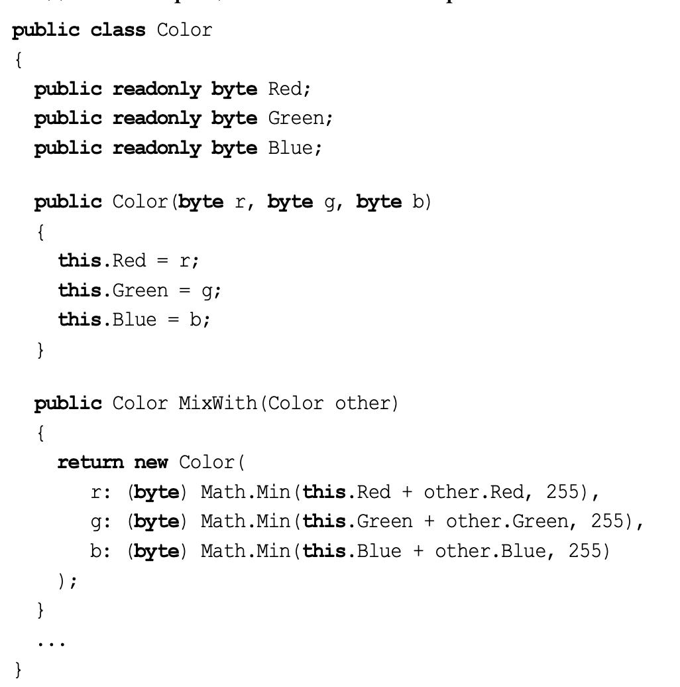

> **Когда следует использовать объекты-значения?**
> - при любой возможности

---

### Сущность (entity)

<br />

> Сущность является противоположностью объекта-значения. 
> Для нее требуется явно указанное поле идентификации, чтобы различать разные экземпляры объекта

```
class Person {
    uuid id; <-- идентификатор
    FirstName firstName;
    Email email;
    Country country;
    Phone phone;
}
```

**Основное требование к полю идентификации** — его уникальность для каждого экземпляра сущности

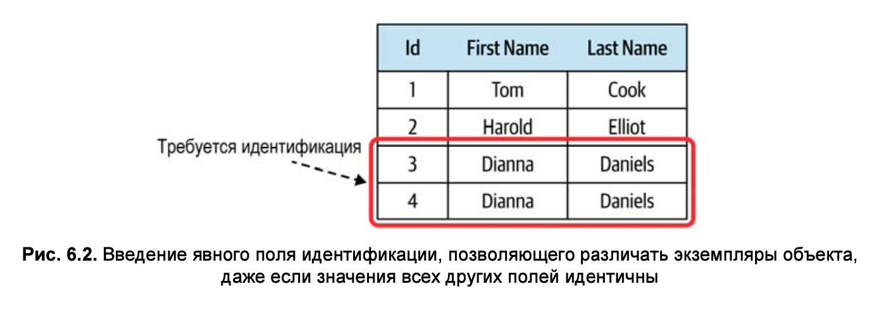

---

### Агрегаты

<br />

> Агрегат — это тоже сущность: для него требуется явное поле идентификации, 
> и ожидается, что его состояние в течение жизненного цикла экземпляра будет изменяться.

<br />

> Поскольку данные агрегата могут изменяться, существуют последствия и проблемы, которые паттерн должен решать 
> для сохранения согласованности своего состояния.

Ключевые понятия:
- Соблюдение согласованности
  - проводим четкую границу между агрегатом и «внешним миром»
  - Логика агрегата должна проверять все входящие модификации и гарантировать непротиворечивость изменений его бизнес-правилам

---

### Агрегаты

<br />

> Методы изменения состояния, представленные в открытом интерфейсе агрегата, часто называют командами (command), например «командой сделать что-то».

<br />

1. Команду можно реализовать как простой открытый метод агрегатного объект

```
class Order {
  void AddProduct(userId, productId, quantity) { // ... }
}
```

2. Команду можно реализовать как отдельный объект

```
class AddProductCommand {
   UUID userId;
   UUID productId;
   int  quantity;
}

class Order {
  Execute(AddProductCommand command) { // ... }
}
```

---

### Агрегаты

<br />

> Открытый интерфейс агрегата отвечает за проверку входных значений и соблюдение всех соответствующих бизнес-правил и инвариантов
> Это делает слой приложения более простым и понятным, так как все изменения состояния агрегата происходят через его открытый интерфейс.

<br />

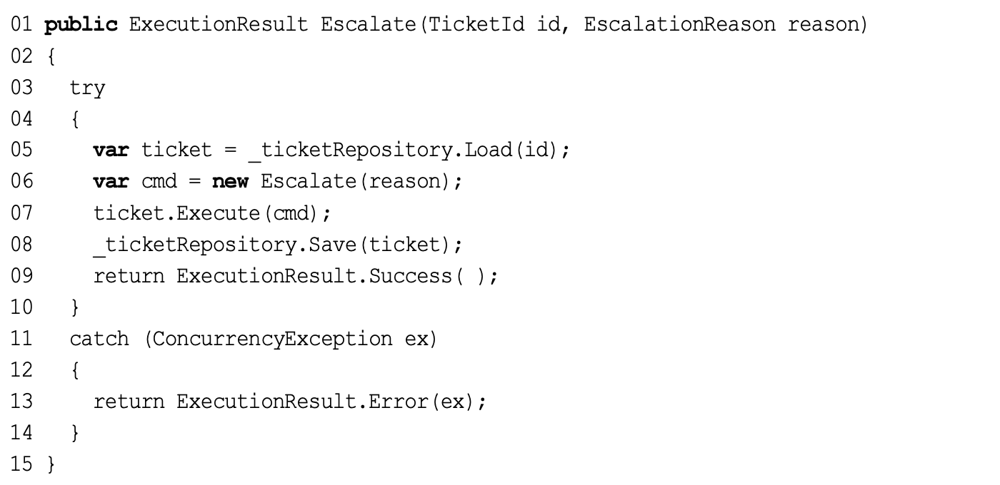

---

### Агрегаты

<br />

Защита от конкурентных изменений:

1. Добавить проверку на уровне кода
2. Добавить проверку на уровне базы данных (оптимистическая блокировка)

```
class Ticket {
  Id id;
  Version version;
}
```

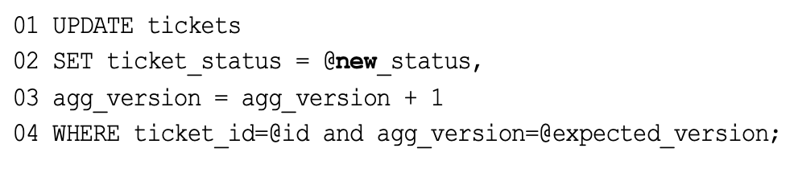

---

### Граница транзакции

<br />

> Важно, чтобы все изменения состояния агрегата происходили в рамках одной транзакции

---

### Иерархия сущностей.

> Сущности используются исключительно как часть агрегата, а не в качестве независимого паттерна

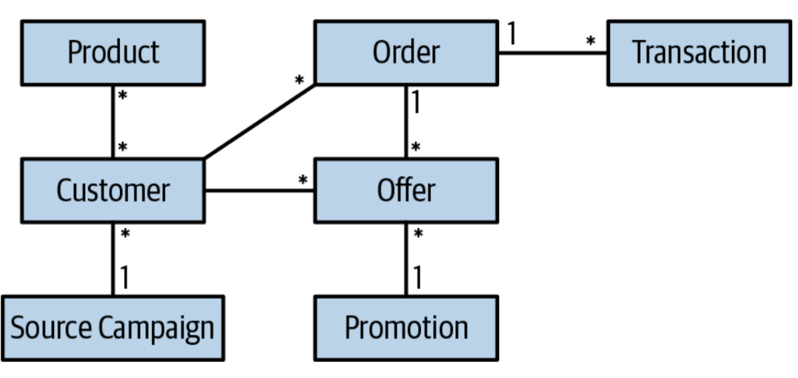

> Вот почему паттерн называется «агрегат»: он объединяет бизнес-сущности и объекты-значения, 
> находящиеся в рамках одной и той же границы транзакции.

```
func Ticket() {
  tx.Start()
  
  tickerService.AddTicket()
  billingService.Charge()
  eventService.Publish()
  tickerService.CompleteTicket()
  
  tx.Commit()
}
```

---

### Ссылки на другие агрегаты

> если агрегат станет слишком большим, могут возникнуть проблемы производительности и масштабируемости

Вся информация, которая может быть согласована по прошествии некоторого времени (согласованность в конечном счете, 
eventual consistency), должна находиться за пределами агрегата

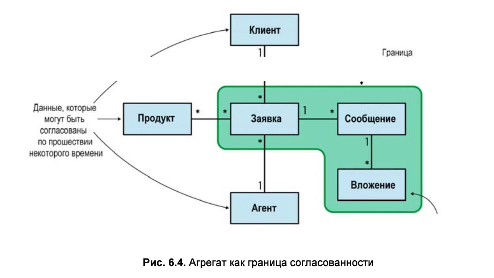

> Чтобы решить, принадлежит сущность агрегату или нет, следует проверить, содержит ли агрегат бизнес-логику, 
> которая может привести к недопустимому состоянию системы при работе с данными по принципу согласованности в конечном счете.

---

### Корень агрегата

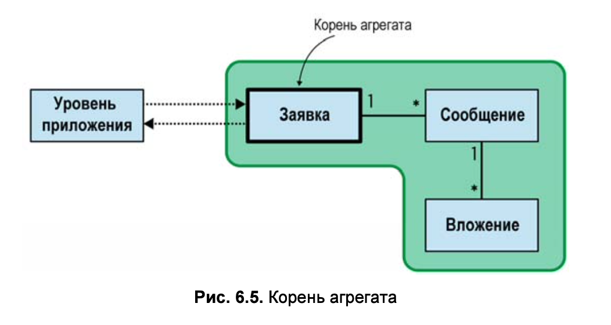

---

### События предметной области

> Событие предметной области — это сообщение с описанием важного события, произошедшего в бизнес-области. 

Например:
- создание заказа
- изменение статуса заказа
- отмена заказа
- изменение адреса доставки

---

### События предметной области

Цель события предметной области (domain event) — дать описание тому, что про- изошло в предметной области, и предоставить все необходимые данные, связанные с событием. 

Например:

```
# change address event
{
  orderId: 123,
  newAddress: "New York, 5th Avenue, 123"
}

# order created event
{
  orderId: 123,
  userId: 456,
  products: [
    {productId: 1, quantity: 2},
    {productId: 2, quantity: 1}
  ]
}
```

---

### События предметной области

> События предметной области являются частью публичного интерфейса агрегата, который публикует события своей предметной области.

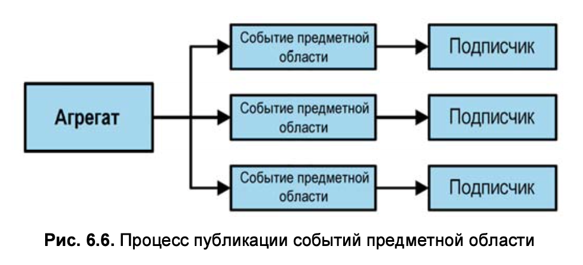

---

### Доменные сервисы

Со временем можно столкнуться с бизнес-логикой, которая либо не принадлежит ни одному агрегату или объекту-значению, 
либо представляется имеющей отношение сразу к нескольким агрегатам. 
В таких случаях предметно-ориентированное проектирование предлагает реализовать логику в виде доменного сервиса.

> Доменный сервис — это объект без состояния, в котором реализуется бизнес-логика.

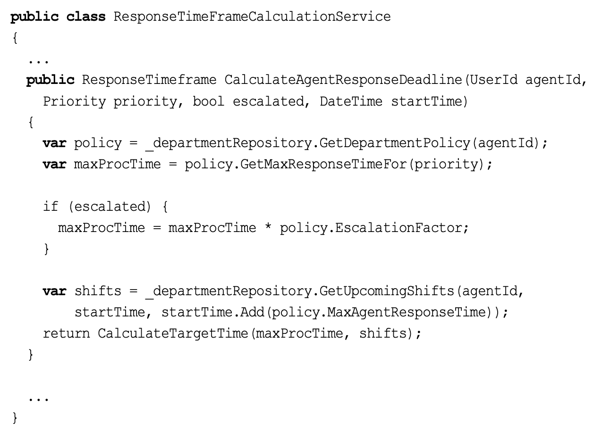

---

### Управление сложностью. Степень свободы

<br />

> В начале главы уже говорилось, что паттерны агрегатов и объектов-значений были введены как средства преодоления 
сложности при реализации бизнес-логики.

---

### Управление сложностью. Степень свободы

```
class A {
  public int A { get; set; }
  public int B { get; set; }; public int C { get; set; }; public int D { get; set; }; public int E { get; set; }
}
```

```
class B {
  public int A {
    get { return a }
    set {
      a = value
      b = a * 2
      c = a * 3
    }
  }
  public int B { get; private set; }; public int C { get; private set; }; public int E { get; private set; }
  public int D {
    get { return d }
    set {
        d = value
        e = d * 2
    }
  }
} 
```

---

### Управление сложностью. Степень свободы

<br />

- Сколько элементов данных нужно для описания состояния ClassA?
- Сколько элементов данных нужно для описания состояния ClassB?
  
<br />

> Возвращаясь к первоначальному вопросу: поведение какого из классов сложнее поддается контролю и предсказанию? <br />
> Ответ — того, у которого больше степеней свободы, или ClassA. Инварианты, введенные в ClassB, уменьшают его сложность. 
> Именно это и делают паттерны агрегатов и объектов-значений: инкапсулируют инварианты, уменьшая таким образом сложность.

<br />

> Вся бизнес-логика, связанная с состоянием объекта-значения, находится в его границах. 
> То же самое справедливо и для агрегатов. Агрегат может быть изменен только его собственными методами. 
> Его бизнес-логика инкапсулирует и защищает бизнес-инварианты, уменьшая тем самым степень свободы.

---

### Выводы

Паттерн модели предметной области предназначен для случаев сложной бизнес-логики. 
Он состоит из трех основных строительных блоков:

- Объектов-значений
- Агрегатов
- Доменных сервисов