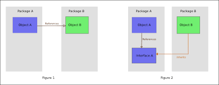

---
# You can also start simply with 'default'
theme: seriph
# random image from a curated Unsplash collection by Anthony
# like them? see https://unsplash.com/collections/94734566/slidev
background: https://cover.sli.dev
# some information about your slides (markdown enabled)
title: DDD Learning - Part 4
info: |
  ## Slidev Starter Template
  Presentation slides for developers.

  Learn more at [Sli.dev](https://sli.dev)
# apply unocss classes to the current slide
class: text-center
# https://sli.dev/features/drawing
drawings:
  persist: false
# slide transition: https://sli.dev/guide/animations.html#slide-transitions
transition: slide-left
# enable MDC Syntax: https://sli.dev/features/mdc
mdc: true
---

# DDD Learning: Part 4

---

### Выводы из предыдущих частей

Паттерн модели предметной области предназначен для случаев сложной бизнес-логики.
Он состоит из трех основных строительных блоков:

- Объектов-значений
- Агрегатов
- Доменных сервисов

<hr />

Модели работы с данными:

- Транзакционный сценарий
- Активная запись

---

### Глава 7: Моделирование фактора времени

---

### События как источник данных (Event Sourcing)


---

### События как источник данных (Event Sourcing)

Если изучить таблицу, то можно увидеть/предположить:

- Цепочка статусов заказа
- Итоги звонка лиду
- Статус платежа

> Мы не можем проанализировать, что происходило в течение жизненного цикла лидов. 
> Мы не знаем, сколько звонков было сделано до того, как лид стал CONVERTED. 

---

### События как источник данных (Event Sourcing)

> С точки зрения бизнеса крайне важно вести анализ данных и оптимизировать процесс на основе полученного опыта.

Пример событий:

```json
[
  {
    "type": "lead_created",
    "data": { "lead_id": 1 }
  },
  {
    "type": "contacted",
    "data": { "lead_id": 1 }
  },
  {
    "type": "contact_details_updated",
    "data": {
      "lead_id": 1,
      "new_contact_details": {
        "phone": "123-456-7890",
        "email": "example@example.com"
      },
      "updated_at": "2021-01-04T00:00:00Z"
    }
  },
  {
    "type": "order_submitted",
    "data": {
      "lead_id": 1,
      "order_id": 1,
      "submitted_at": "2021-01-05T00:00:00Z"
    }
  },
  {
    "type": "payment_confirmed",
    "data": {
      "lead_id": 1,
      "order_id": 1,
      "confirmed_at": "2021-01-06T00:00:00Z"
    }
  }
]
```

---

### События как источник данных (Event Sourcing)

Остается применить эти события для получения актуального состояния объекта.

```go
func main() {
    events := []Events{}
    state := State{}
    
    for _, event := range events {
        state.Apply(event)
    }
}

func (s *State) Apply(event Event) {
    // ...logic
	
	// increment version
	s.Version++
}
```

---

### События как источник данных (Event Sourcing)

<br>

#### Поиск

Контактные данные могут быть изменены несколько раз и это проблема в классической модели,
но в модели событий это не проблема так как мы можем просто пройтись по всем событиям и найти нужные данные в истории изменений.

#### Анализ

Мы можем анализировать данные и оптимизировать процесс на основе полученного опыта.

---

### События как источник данных (Event Sourcing)


> - События хранятся в хранилище событий (Event Store)
> - События нельзя изменить или удалить

---

### Модель предметной области, основанная на событиях

- Загрузка событий
- Применение событий (получение актуального состояния объекта)
- Выполнение действий бизнес-логики (создание новых событий)
- Сохранение событий

---

### События как источник данных (Event Sourcing)

#### Snapshot


---

### События как источник данных (Event Sourcing)

#### Преимущества

- Путешествие во времени
- Возможность анализа
- Аудит
- Возможность изменить бизнес-логику
- Защита от конкуренции (Optimistic Locking)

#### Недостатки

- Сложность
- Сложность
- Сложность
- Производительность (решается снепшотами)
- Как удалять данные? (GDPR/etc - решается анонимизацией)

---

### Архитектурные паттерны (Глава 8)

> Сопоставление бизнес-логики и архитектурных паттернов

---

### Архитектурные паттерны: Слоистая архитектура (Layered Architecture)


> В своей классической форме слоистая архитектура состоит из трех слоев: слоя представления (presentation layer — PL), слоя бизнес-логики (business logic layer — BLL) и слоя доступа к данным (data access layer — DAL).

> Слои интегрированы в коммуникационную модель типа «сверху вниз»

---

### Сервисный слой (Service layer)

> Сервисный слой действует как посредник между имеющимися у программы слоями представления и бизнес-логики


#### Преимущества

- Уменьшение связанности
- Удобство тестирования
- Повторное использование кода

---

### Дополнительно: сравнение слоев и уровней


> Слоистую архитектуру часто путают с архитектурой N-Tier (многоуровневой) и наоборот. Несмотря на сходство между двумя паттернами, слои и уровни (tiers) концептуально различаются: слой — это логическая граница, а уровень — физическая граница.

---

### Порты и адаптеры (Ports and adapters)

> Архитектура портов и адаптеров устраняет недостатки слоистой архитектуры и больше подходит для реализации более сложной бизнес-логики


---

### Порты и адаптеры (Ports and adapters)

#### Принцип инверсии зависимостей (Dependency inversion principle)

> Принцип инверсии зависимостей (dependency inversion principle — DIP) гласит, что высокоуровневые модули, реализующие бизнес-логику, не должны зависеть от низкоуровневых модулей.



---

### Порты и адаптеры (Ports and adapters)


> Основная цель архитектуры портов и адаптеров — отделить бизнес-логику системы от ее инфраструктурных компонентов.

> Вместо того, чтобы ссылаться на инфраструктурные компоненты или вызывать их напрямую, слой бизнес-логики определяет «порты», которые должны быть реали- зованы на слое инфраструктуры.

---

### Разделение ответственности команд и запросов (Command-Query Responsibility Segregation)

> Паттерн разделения ответственности команд и запросов (command-query respon- sibility segregation — CQRS)


---

### CQRS

#### Мультипарадигменное моделирование (Polyglot modelling)

Нужен для отделения разных типов запросов:

- online transaction processing — **OLTP**
- online analytical processing — **OLAP**

Так же для возможности использования разных хранилищ данных для разных типов запросов.

---

### CQRS

#### Модель выполнения команд

> CQRS выделяет единую модель для выполнения операций, которые изменяют со- стояние системы (системные команды). Эта модель используется для реализации бизнес-логики, проверки соблюдения правил и соблюдения инвариантов.

#### Модели чтения (проекции)

> Для выполнения запросов CQRS использует модели чтения (read models), которые представляют собой проекции данных из модели выполнения команд.

---

### CQRS: Синхронные проекции


> Чтобы догоняющая подписка работала, модель выполнения команд должна ставить контрольную точку (checkpoint) на все новые или обновленные записи базы дан- ных. Механизм хранения также должен поддерживать запрос записей на основе контрольных точек.
---

### CQRS: Асинхронные проекции


---

### CQRS

#### Преимущества

- Улучшение производительности
- Улучшение масштабируемости
- Хорошо подходит для событийно-ориентированных систем

---

### Выводы


---

### Выводы

<br>

> Слоистая архитектура предусматривает разбивку кодовой базы на основе решаемых технологических задач. 
> Поскольку этот паттерн объединяет бизнес-логику с реализацией доступа к данным, он хорошо подходит для систем на основе использования активных записей.

<br>

> В архитектуре портов и адаптеров отношения инвертируются: 
> бизнес-логика ставится в центр и отделяется от всех инфраструктурных зависимостей. 
> Этот паттерн хорошо подходит для бизнес-логики, реализованной с помощью паттерна модели предметной области.

<br>

> Паттерн CQRS представляет одни и те же данные сразу в нескольких моделях.

---

### Паттерны взаимодействия (Глава 9)

#### Преобразование моделей

> Преобразование моделей — это процесс преобразования данных из одной модели в другую.

---

### Преобразование моделей без сохранения состояния


#### Синхронный режим


---

### Преобразование моделей: API Gateway


---

### Преобразование моделей без сохранения состояния

#### Асинхронный режим


---

### Преобразование моделей с отслеживанием состояния

#### Агрегирование входящих данных (пакетная обработка)


#### Агрегирование входящих данных (объединение)


---

### Объединение нескольких источников


---

### Интеграция агрегатов: Паттерн исходящих сообщений (Outbox)


#### Извлечение неопубликованных событий

- pull: запрос к поставщику (producer) (пулим БД)
- push: отслеживание журнала транзакций (триггеры)

---

### Интеграция агрегатов: Сага

- Хореография - когда каждый агрегат самостоятельно решает, что делать
- Оркестрация - когда есть центральный агрегат, который управляет всеми остальными


---

### Интеграция агрегатов: Сага


