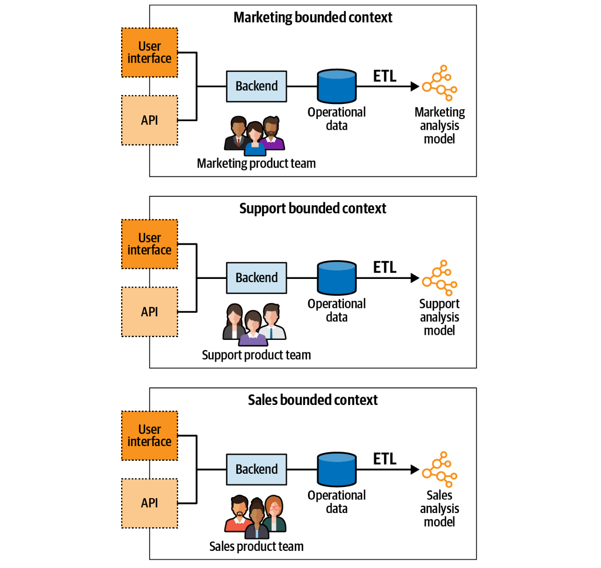
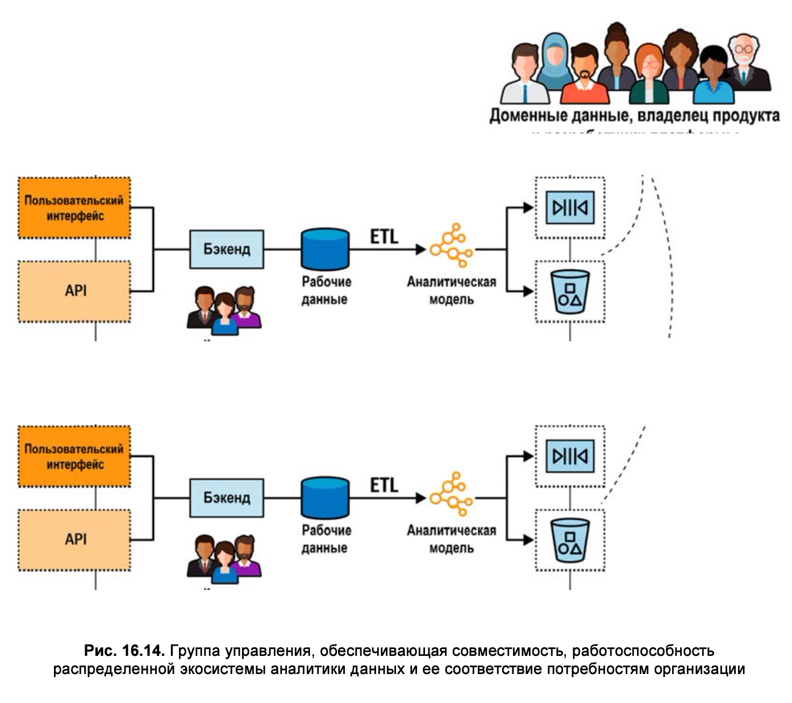

---
# You can also start simply with 'default'
theme: seriph
# random image from a curated Unsplash collection by Anthony
# like them? see https://unsplash.com/collections/94734566/slidev
background: https://cover.sli.dev
# some information about your slides (markdown enabled)
title: DDD Learning Part 7
info: |
  ## Slidev Starter Template
  Presentation slides for developers.

  Learn more at [Sli.dev](https://sli.dev)
# apply unocss classes to the current slide
class: text-center
# https://sli.dev/features/drawing
drawings:
  persist: false
# slide transition: https://sli.dev/guide/animations.html#slide-transitions
transition: slide-left
# enable MDC Syntax: https://sli.dev/features/mdc
mdc: true
---

# DDD Learning: Part 4

Взаимоотношения с другими методологиями и паттернами

---

## Содержание

<br/>

1. Microservices
2. Event-driven architecture
3. Data Mesh (data lakes)

---

## Microservices

<br/>

- Большие сервисы vs распределенные большие комки грязи (big ball of mud) 
- Bounded Context && Microservices

---

### Что такое сервис?

> Согласно OASIS сервис — это механизм, обеспечивающий доступ к одной или нескольким бизнес-компетенциям (capability), 
> предоставляемый с использованием предписанного интерфейса (prescribed interface)1. А предписанный интерфейс 
> (prescribed interface) — это любой способ передачи данных в сервис и получения данных из него. Он может быть синхронным, 
> например моделью запрос-ответ (request/response), или асинхронным, например моделью, отправляющей и принимающей события.


---

### Что такое микросервис?

<br/>

> Поскольку сервис определяется своим публичным интерфейсом, микросервис — это сервис с публичным микроинтерфейсом (входной микродверью).


<br/>

**Наличие публичного микроинтерфейса:**

Упрощает понимание функции отдельного сервиса
интеграции с другими компонентами системы


<br/>

**Сокращение функциональности сервиса:**
ограничивает круг причин для его изменений
делает сервис более автономным для разработки, управления и масштабирования

---

### Serverless: Метод как Сервис (Method as a Service)


> Поскольку это микросервисы с правильным поведением, каждый из них инкапсулирует свою базу данных. 
> Ни одному сервису не разрешен прямой доступ к базе данных другого сервиса, он возможен только через его публичный интерфейс

---

### Serverless: Метод как Сервис (Method as a Service)

> Сервисы должны работать вместе и синхронизировать изменения, вносимые каждым сервисом. То есть возникает необходимость 
> расширения интерфейсов сервисов, позволяющего учесть возникшие проблемы интеграции.


---

### Цель проектирования

<br/>

Следование упрощенной эвристике декомпозиции, согласно которой каждым сервисом предоставляется только один метод, оказалось неоптимальным по многим причинам.

+ возникла необходимость расширения их публичных интерфейсов
+ каждый сервис оказался намного проще исходного, но в совокупности получающаяся система стала на несколько порядков сложнее.

<br/>

> Цель микросервисной архитектуры заключается в создании гибкой системы. Сосредоточение усилий проектирования на одном компоненте при игнорировании порядка его взаимодействия со всей остальной частью системы противоречит самому определению системы:
> - Набор взаимосвязанных элементов или устройств, работающих вместе.
> - Набор компьютерного оборудования и программ, используемых вместе для достижения определенной цели.

---

### Сложность системы

> В нашем контексте под локальной сложностью понимается сложность каждого отдельно взятого микросервиса, а под глобальной сложностью — сложность всей системы. Локальная сложность зависит от реализации сервиса, а глобальная сложность определяется взаимодействиями и зависимостями между сервисами.


глобальную сложность -> монолит  
локальную сложность -> микросервисы-методы

---

### Микросервисы как «глубокие» сервисы (deep services)

> Верхний край прямоугольника является представлением функции модуля или сложности его публичного интерфейса. Чем шире прямоугольник, тем
> шире функциональность, а чем он у же, тем ограниченнее его функция и, следовательно, проще публичный интерфейс. Площадь прямоугольника является представлением логики модуля или реализации его функциональности.


> Согласно этой модели эффективные модули глубоки: в простом публичном интерфейсе инкапсулируется сложная логика. Неудачные модули слишком мелки: в публичном интерфейсе мелкого модуля инкапсулируется гораздо меньшая сложность, чем в интерфейсе глубокого модуля.

---

### Микросервисы как «глубокие» сервисы (deep services)

<br/>

> Пример мелкого модуля: открытый интерфейс (сигнатура метода) и его логика (методы) абсолютно одинаковы. 
> Такой вот модуль вводит в систему лишние «подвижные детали» (moving parts), и, стало быть, вместо инкапсуляции сложности он добавляет совершенно непреднамеренную сложность (accidental complexity) ко всей системе.


<br/>

```
int AddTwoNumbers(int a, int b) {
    return a + b; 
}
```

---

### Микросервисы как глубокие модули

> понятие глубоких модулей отличается от микросервисов тем, что модулями могут обозначаться как логические, так и физические границы, тогда как микросервисы имеют строго физические границы


> По мере декомпозиции монолита на микросервисы стоимость внесения изменений снижается и достигает минимума при достижении уровня порогового значения. Но, если продолжить декомпозицию и выйти за пороговое значение, сервисы будут становиться все мельче и мельче, а их интерфейсы будут разрастаться. И тогда потребности в интеграции поднимут стоимость внесения изменений, а общая архитектура системы превратится в ужасающий распределенный большой ком грязи.

---

## Предметно-ориентированное проектирование и границы микросервисов


<br/>

> Применительно к микросервисам многие из паттернов предметно-ориентированного проектирования, 
> рассмотренные в предыдущих главах, связаны с границами: ограниченный контекст (**bounded context**) 
> является границей модели, поддомен ограничивает бизнес-компетенции (**capabilities**), а агрегаты (**aggregate**) и 
> объектызначения (**value object**) определяют границы транзакций.

---

### Ограниченные контексты


> И микросервисы, и ограниченные контексты определяются физическими границами. 
> Микросервисы как ограниченные контексты разрабатываются одной командой. Как и в ограниченных контекстах, 
> конфликтующие модели не могут быть реализованы в микросервисе, что приводит к усложнению интерфейсов. 
> Микросервисы, конечно же, являются ограниченными контекстами. Но работает ли эта связь наоборот?

Микросервисы (**yes**)-> ограниченные контексты  
Ограниченные контексты (**no**)-> микросервисы

> В одном и том же ограниченном контексте нельзя реализовать никакие конфликтующие модели.

---

### Ограниченные контексты

> Поддомены можно перемещать из одного ограниченного контекста в другой. Пока модели в поддоменах не конфликтуют, все альтернативные варианты декомпозиции (разбиения),
> являются вполне допустимыми ограниченными контекстами.


> Разные декомпозиции для ограниченных контекстов мотивируются разными требованиями, например разным количественным составом и структурами команд разработчиков, зависимостями жизненного цикла и т. д.

---

### Ограниченные контексты

<br/>

> Безопасной считается область между ограниченными контекстами и микросервисами. В ней находятся допустимые варианты конструкции. Но если система не разбита на надлежащие ограниченные контексты или разбита за порогом микросервисов, то получится соответственно либо большой ком грязи, либо он же, но в распределенном виде.


---

### Агрегаты

<br/>


> Граница агрегата — самая узкая из всех возможных границ. Разбивать агрегат на несколько физических сервисов или ограниченных контекстов не только нерационально, но и приводит, к нежелательным последствиям.


<br/>

> Как и ограниченные контексты, границы агрегатов также часто рассматриваются в качестве определяющих границ микросервисов. Агрегат является неделимой единицей бизнес-функции, инкапсулирующей все сложности своих внутренних бизнес-правил, инвариантов и бизнес-логики.

Отдельный сервис следует рассматривать в контексте его взаимодействия с другими компонентами системы:
Осуществляет ли рассматриваемый агрегат обмен данными с другими агрегатами в своем поддомене?
Использует ли он объекты-значения совместно с другими агрегатами?
Насколько высока вероятность, что изменения бизнес-логики агрегата повлияют
  на другие компоненты поддомена и наоборот?

> Чем сильнее связь агрегата с другими сущностями его поддомена, тем в меньшей степени он будет считаться отдельным сервисом.
> В отдельных случаях использование агрегата в качестве сервиса приводит к модульному дизайну.

---

### Поддомены

> Более сбалансированный эвристический подход к разработке микросервисов заключается в подстраивании сервисов под границы поддоменов. 


<br/>

> С позиции предметной области поддомены конкретизируют бизнес-компетенции (capabilities) — т. е. то, чем этот бизнес занимается, — без объяснения того, как эти бизнес-компетенции реализуются. С технической точки зрения поддомены представляют собой наборы согласованных сценариев использования: использование одной и той же модели предметной области, работа с одними и теми же или тесно связанными данными и тесная функциональная взаимосвязь


> Увязывание микросервисов с поддоменами — безопасный эвристический подход, позволяющий найти оптимальные решения для большинства микросервисов.

---

### Сокращение публичных интерфейсов микросервисов: Сервис с открытым протоколом

> Сервис с открытым протоколом (open-host service) отделяет модель ограниченного контекста предметной области от модели, используемой для интеграции с другими компонентами системы

> Внедрение модели, ориентированной на интеграцию, т. е. внедрение общедоступного языка (published language), снижает глобальную сложность системы.

это позволяет осуществлять дальнейшее развитие сервиса, не затрагивая при этом его потребителей
опубликованный язык выставляет на всеобщее обозрение куда более ограниченную модель

> Наличие более простого публичного интерфейса (функции) в качестве надстройки над той же самой реализацией (логикой) делает сервис «глубже» и способствует созданию более эффективной конструкции микросервиса.


---

### Предохранительный слой (anticorruption layer, ACL)

> Предохранительный слой (anticorruption layer, ACL) работает с точностью до наоборот, что позволяет снизить сложность интеграции сервиса с другими ограниченными контекстами. Традиционно предохранительный слой относится к защищаемому им ограниченному контексту

<br/>

> Cложность ограниченного контекста-потребителя отделена от сложности интеграции, которая помещается в ACL-сервис. Поскольку ограниченный контекст-потребитель сервиса работает с более удобной, ориентированной на интеграцию моделью, его открытый интерфейс сужается — он не отражает той сложности интеграции, которая предоставляется сервисом-поставщиком (producer).


---

### Вывод

<br/>

> Все микросервисы являются ограниченными контекстами, но не все ограниченные контексты в обязательном порядке являются 
> микросервисами. По сути, микросервис определяет наименьшую допустимую границу сервиса, а ограниченный контекст защищает 
> согласованность охватываемой им модели и представляет самые широкие допустимые границы. Определение границ шире их 
> ограниченных контекстов приведет к появлению большого кома грязи, а если границы будут охватывать пространство меньше 
> микросервисов, то возникнет распределенный большой ком грязи.

---

## Event-driven architecture (Событийно-ориентированная архитектура)

<br/>

> Событийно-ориентированная архитектура часто связана с предметно-ориентированным проектированием. Ведь EDA основана на событиях, которые занимают видное место и в предметно-ориентированном проектировании (DDD), где имеются события предметной области, и в случае необходимости они даже используются в качестве источника данных в системе. Может возникнуть соблазн воспользоваться DDD-событиями в качестве основы для использования событийно-ориентированной архитектуры. Но стоит ли это делать?

<br/>

> События — это не какая-то секретная приправа, которую можно просто добавить в прежнюю систему и сделать ее слабо связанной и распределенной. Как раз-таки наоборот: опрометчивое применение EDA может превратить модульный монолит в распределенный большой ком грязи.

---

### Событийно-ориентированная архитектура

> В простом изложении событийно-ориентированная архитектура представляет собой архитектурный стиль, в котором компоненты системы взаимодействуют друг с другом асинхронно, обмениваясь сообщениями о событиях
> Компоненты могут подписываться на события, возникающие в системе, и соответствующим образом на них реагировать.


> Хотя и событийно-ориентированная архитектура, и «События как источник данных» основаны на событиях, эти два паттерна концептуально различаются. EDA относится к взаимодействию сервисов, а «События как источник данных» происходит внутри сервиса. События, разработанные при применении паттерна «События как источник данных», представляют переходы состояний (агрегатов в модели предметной области, основанной на событиях), реализованные в сервисе. Эти события нацелены на фиксацию нюансов бизнес-области и не предназначены для интеграции сервиса с другими компонентами системы.

---

### События: События, команды и сообщения

**Событие** — это сообщение, но сообщение — не обязательно событие. Существуют два типа сообщений:

- Событие Сообщение, описывающее уже произошедшее изменение.
- Команда Сообщение, предписывающее произвести изменение.

**Событие** — это то, что уже произошло, тогда как команда — это инструкция, предписывающая некое действие.

И события, и команды могут передаваться асинхронно в виде сообщений. 
Но **команда** может быть отклонена: получатель команды может отказаться от ее выполнения, например если команда недействительна или противоречит бизнес-правилам системы. 
А **событие** его получатель отменить не может. В нем описывается то, что уже произошло. Единственное, что можно сделать, чтобы отменить событие, — это выполнить компенсирующее действие — команду, наподобие того, как это делается в паттерне саги.

Поскольку событие описывает что-то, что уже произошло, название события должно быть сформулировано в прошедшем времени: например, **DeliveryScheduled** (доставка запланирована), **ShipmentCompleted** (отгрузка завершена) или **DeliveryConfirmed** (доставка подтверждена).

---

### События: Структура

Событие — это структура данных, которую можно сериализовать и передать с помощью выбранной платформы обмена сообщениями. Типичная схема события включает метаданные события и его полезную нагрузку (payload) — информацию, передаваемую событием:

```json
{
    "type": "delivery-confirmed",
    "event-id": "14101928-4d79-4da6-9486-dbc4837bc612", 
    "correlation-id": "08011958-6066-4815-8dbe-dee6d9e5ebac", 
    "delivery-id": "05011927-a328-4860-a106-737b2929db4e", 
    "timestamp": 1615718833,
    "payload": {
        "confirmed-by": "17bc9223-bdd6-4382-954d-f1410fd286bd",
        "delivery-time": 1615701406 
    }
}
```

---

### События: Уведомление (event notification) 

Это сообщение об изменении в предметной области, на которое будут реагировать другие компоненты.
К ним среди прочего можно отнести PaycheckGenerated (расчетный чек создан) и CampaignPublished (реклама опубликована).

Уведомление не должно быть излишне подробным: цель — уведомить заинтересованные стороны о событии, но уведомление не должно содержать всю информацию, необходимую подписчикам для проявления реакции на событие. Например:

```json
{
    "type": "paycheck-generated",
    "event-id": "537ec7c2-d1a1-2005-8654-96aee1116b72", "delivery-id": "05011927-a328-4860-a106-737b2929db4e", "timestamp": 1615726445,
    "payload": {
        "employee-id": "456123",
        "link": "/paychecks/456123/2021/01"
     }
}
```


---

### События: Уведомление (event notification)


```json
{
    "type": "paycheck-generated",
    "event-id": "537ec7c2-d1a1-2005-8654-96aee1116b72", "delivery-id": "05011927-a328-4860-a106-737b2929db4e", "timestamp": 1615726445,
    "payload": {
        "employee-id": "456123",
        "link": "/paychecks/456123/2021/01"
     }
}
```


---

### События: Уведомление (event notification) 

Краткие уведомления могут быть предпочтительнее в целом ряде сценариев. Давайте более подробно рассмотрим два из них: безопасность и конкурентность.

**Безопасность.** Принуждение получателя к явному запросу подробной информации препятствует обмену конфиденциальной информацией через инфраструктуру обмена сообщениями и требует дополнительной авторизации подписчиков для доступа к данным.

**Конкурентность**. В силу асинхронной природы событийно-ориентированной интеграции информация, дошедшая до подписчиков, может уже оказаться устаревшей. Во избежание состояния гонки, если характер информации чувствителен к нему, актуальное состояние можно получить, сделав явный запрос.


---

### События: Передача состояния с помощью события (snapshot)

Сообщения передачи состояния с помощью события (Event-carried state transfer, ECST) уведомляют подписчиков об изменениях во внутреннем состоянии поставщика. В отличие от сообщений с уведомлением о событии, ECST-сообщения включают все данные, отражающие изменение состояния.

ECST-сообщения могут поступать в двух формах. Первая форма содержит полный срез состояния (snapshot) измененного объекта:

```json
{
    "type": "customer-updated",
    "event-id": "6b7ce6c6-8587-4e4f-924a-cec028000ce6", 
    "customer-id": "01b18d56-b79a-4873-ac99-3d9f767dbe61", 
    "timestamp": 1615728520,
    "payload": {
        "first-name": "Carolyn", "last-name": "Hayes",
        "phone": "555-1022",
        "status": "follow-up-set", "follow-up-date": "2021/05/08", "birthday": "1982/04/05", "version": 7
    } 
}
```

---

### События: Передача состояния с помощью события (diff)

ECST-сообщение, показанное в предыдущем примере, включает в себя полный снимок обновленного состояния клиента. При работе с большими структурами данных может оказаться целесообразным включать в ECST-сообщение только поля, подвергшиеся фактическим изменениям:

```json
{
    "type": "customer-updated",
    "event-id": "6b7ce6c6-8587-4e4f-924a-cec028000ce6", 
    "customer-id": "01b18d56-b79a-4873-ac99-3d9f767dbe61", 
    "timestamp": 1615728520,
    "payload": {
        "status": "follow-up-set", 
        "follow-up-date": "2021/05/10", 
        "version": 8
    } 
}
```

---

### События: Передача состояния с помощью события

<br/>

> Концептуально использование сообщений с передачей состояний с помощью события представляет собой механизм асинхронной репликации данных. Такой подход повышает отказоустойчивость системы, а это означает, что потребители получают возможность продолжать работу, даже если поставщик недоступен. Он также дает возможность повысить производительность компонентов, нацеленных на обработку данных из нескольких источников. Вместо запросов, посылаемых каждый раз в источники востребованных данных, все эти данные, как показано на рис. 15.4, можно кешировать локально.


---

### События: События предметной области (domain event)

<br />

> В определенном смысле события предметной области одновременно похожи как на уведомления, так и на ECST-сообщения: в них не только дается описание важного события в бизнес-области, но и содержатся все характеризующие это событие данные. Несмотря на сходство, концепция у всех этих типов сообщений разная.

---

### События предметной области (domain event)

В событиях предметной области, как и в уведомлениях, дается описание изменения, произошедшего в бизнес-области поставщика события. И все же здесь есть два концептуальных различия.

События предметной области включают всю информацию, описывающую событие. Чтобы получить полную картину, потребителю не нужно предпринимать никаких дополнительных действий.
При моделировании в них вкладывается разный смысл. 

Уведомления разработаны с целью упростить интеграцию с другими компонентами. А события предметной области предназначены для моделирования и описания предметной области. События предметной области могут оказаться полезными, даже если в них не заинтересован ни один внешний потребитель. 

Это особенно актуально для систем с событиями как источником данных (Event Sourcing), где события предметной области используются для моделирования всех возможных переходов состояний.

---

### Типы событий: Пример

Рассмотрим следующие три способа представления события вступления в брак:

```json
eventNotification = {
    "type": "marriage-recorded", "person-id": "01b9a761", "payload": {
        "person-id": "126a7b61",
        "details": "/01b9a761/marriage-data" 
    }
};

ecst = {
    "type": "personal-details-changed", "person-id": "01b9a761",
    "payload": {
        "new-last-name": "Williams"
    }
};

domainEvent = {
    "type": "married", "person-id": "01b9a761", "payload": {
        "person-id": "126a7b61",
        "assumed-partner-last-name": true 
    }
};
```

---

### Проектирование событийно-ориентированной интеграции

---

#### Распределенный большой ком грязи

> Ограниченный контекст (bounded context) CRM (системы управления информацией о клиентах) реализован в виде модели предметной области, основанной на событиях (event-sourced domain model).


---

#### Временнáя связанность (связанность по времени)


Связанность ограниченных контекстов **AdsOptimization** и **Reporting** носит временнóй характер: она зависит от четкого порядка выполнения программы. 
Компонент **AdsOptimization** должен завершить свою обработку данных до запуска модуля **Reporting**. Если порядок выполнения программы будет обратным, в отчетность попадут противоречивые данные.

---

#### Временнáя связанность (связанность по времени)

Чтобы обеспечить необходимый порядок выполнения, программисты ввели в систему **Reporting** задержку. Эта пятиминутная задержка позволяет компоненту **AdsOptimization** завершить все необходимые вычисления. И все же нетрудно заметить, что все это не гарантирует правильный порядок выполнения:

**AdsOptimization** может быть перегружен и не сможет завершить обработку за пять минут.
Проблема с сетью может привести к задержке доставки входящих сообщений сервису **AdsOptimization**.
Компонент **AdsOptimization** может выйти из строя и прекратить обработку входящих сообщений.


---

#### Функциональная связанность


Ограниченные контексты **Marketing** и **AdsOptimization** подписывались на события предметной области **CRM**, из-за чего в них была реализована одна и та же проекция данных о клиентах.

---

#### Связанность на уровне реализации


> Это уже более сложный тип связанности. Ограниченные контексты **Marketing** и **AdsOptimization** подписаны на все события предметной области, выдаваемые моделью **CRM**, основанной на событиях. Следовательно, изменения, вносимые в реализацию **CRM**, например добавление нового события предметной области 
> или изменение схемы существующего события, должны отражаться в обоих подписанных ограниченных контекстах! 
> 
> Невыполнение этого требования может привести к несогласованности данных. Например, если схема события изменится, логика проецирования, имеющаяся у подписчиков, не сработает. Если же в модель **CRM** добавляется новое событие предметной области, оно потенциально может повлиять на те модели, на которые оно проецируется, и, следовательно, его игнорирование приведет к проецированию несогласованного состояния.

---

### Реорганизация событийно-ориентированной интеграции

Чтобы устранить временнýю связанность контекстов **AdsOptimization** и **Reporting**, компонент **AdsOptimization** может публиковать уведомления о событиях, активизируя тем самым компонент **Reporting** для получения им необходимых данных.


---

### Творческий подход к событийно-ориентированному проектированию

Правильное сопоставление типов событий с поставленными задачами делает получаемый в результате этого проект на несколько порядков менее связанным, более гибким и отказоустойчивым. 

**Предполагайте худшее**
  - Сеть будет медленной.
  - Серверы выйдут из строя в самый неподходящий момент.
  - События будут поступать не по порядку.
  - События будут дублироваться.

---

### Творческий подход к событийно-ориентированному проектированию

**Решения**
  - Для надежной публикации сообщений воспользуйтесь паттерном «Ящик исходящих сообщений» (outbox pattern).
  - При публикации сообщений убедитесь, что подписчики смогут избавиться от дубликатов сообщений, а также выявить и переупорядочить неупорядоченные сообщения.
  - При оркестровке трансграничных контекстных процессов, требующих выполнения компенсирующих действий, воспользуйтесь сагой и диспетчером процессов.

---

### Используйте публичный интерфейс и приватные события

При проектировании публичных интерфейсов ограниченных контекстов используйте различные типы событий. Сообщения передачи состояния с помощью события позволяют привести модель реализации к более компактной форме, которая передает потребителям только востребованную ими информацию.

Для еще большей минимизации открытого интерфейса можно воспользоваться уведомлениями о событиях.

---

### Оценивайте требования к согласованности

При проектировании событийно-ориентированного обмена данными в качестве еще одной составляющей эвристического подхода к выбору типа сообщений следует оценивать требования к согласованности ограниченных контекстов:

- Если компоненты могут довольствоваться данными, согласованными по принципу согласованности в конечном счете (eventual consistency), используйте сообщения передачи состояния с помощью события (ECST-сообщения).
- Если потребителю необходимо прочитать последние изменения в состоянии поставщика сообщения, выдайте сообщение с уведомлением о событии с возможностью отправки последующего запроса на получение актуального состояния поставщика.

---

### Вывод

Уведомление о том, что произошло что-то важное, но требующее от потребителя явного запроса дополнительной информации у поставщика уведомления.
Передача состояния с помощью события (**ECST**) Механизм репликации данных на основе сообщений. 
Каждое событие содержит срез состояния, которым можно воспользоваться для поддержания локального кеша данных поставщика.
Событие предметной области Сообщение с описанием события в предметной области поставщика.

Использование неподходящих типов событий приведет к разрушению системы на основе EDA-архитектуры, 
невольно превратив ее в большой ком грязи.

Чтобы выбрать для интеграции правильный тип событий, нужно оценить требования согласованности ограниченных контекстов и проявить осмотрительность 
в раскрытии подробностей их реализации. Следует разработать четкий набор публичных и приватных событий. 
И наконец, следует обеспечить доставку системой сообщений даже в случае технических проблем и сбоев.

---
layout: intro
background: https://cover.sli.dev
class: text-center
---

### Глава 16. Сеть данных (Data Mesh)

---

### OLAP && OLTP


---

### OLAP && **OLTP && DDD**

<br />

> Транзакционные модели (OLTP) строятся вокруг различных сущностей из предметной области системы, реализуя их жизненные циклы и организуя их взаимодействие друг
с другом.

<br />


---

### **OLAP** && OLTP && **DDD**

<br />

#### Таблица фактов

- представляют собой уже произошедшую деловую активность
- отсутствует стилистическое требование называть их глаголами в прошедшем времени
- факты представляют собой действия в рамках бизнес-процессов
- никогда не удаляются и не изменяются


---

### **OLAP** && OLTP && **DDD**

#### Таблица измерений

> Если факт представляет собой бизнес-процесс или действие
(выражаемое глаголом), то измерение дает описание факта (со свойствами прилагательного).  
> Измерения предназначены для описания атрибутов фактов, и на них ссылаются как
на внешний ключ из таблицы фактов в таблицу измерений.


---

### **OLAP** && OLTP && **DDD**

<br />

#### Аналитические модели (многие к одному)

<br />


---

### **OLAP** && OLTP && **DDD**

<br />

#### Аналитические модели (снежинка)


---

### Хранилище данных — Data Warehouse

<br />

> Сначала данные извлекаются из всех рабочих систем предприятия, а затем эти исходные данные трансформируются в аналитическую модель и полученный результат
загружается в базу данных, ориентированную на анализ этих данных. Именно эта
база данных и является хранилищем данных (data warehouse).


---

### Хранилище данных — витрины данных

<br />


---

### Озеро данных — Data Lake

<br />


---

### Проблемы архитектур хранилища данных и озера данных

<br />

- много данных
- частота изменений
- разные команды (коммуникации)

---

### Сеть данных (Data mesh)

<br />

> Архитектура сети данных (data mesh) в некотором смысле представляет собой
предметно-ориентированное проектирование применительно к аналитическим данным. Поскольку различные DDD-паттерны устанавливают границы и защищают свое содержимое, 
архитектура сети данных (data mesh) определяет и защищает гра- ницы модели аналитических данных.

**Архитектура сети данных (data mesh) основана на четырех основных принципах:**

- разбиение данных по предметным областям
- рассмотрение данных как продукта
- обеспечение автономии
- построение экосистемы

---

### Data mesh: Разбиение данных по предметным областям

<br />

> Подходы, используемые как в хранилище данных, так и в озере данных, направлены на объединение всех данных предприятия в одну большую модель. Полученная
аналитическая модель неэффективна по тем же причинам, что и транзакционная
модель в масштабах всего предприятия. Кроме того, сбор данных со всех систем
в одном месте приводит к стиранию границ владения различными элементами
данных.

<br />



---

### Data mesh: Данные как продукт

<br />

> Классические архитектуры управления данными затрудняют исследование, понимание и выборку качественных аналитических данных. Особенно остро это проявляется при использовании озер данных (data lakes).


- Должны быть легко обнаруживаемые нужные эндпоинты: порты вывода данных.
- Аналитические эндпоинты должны иметь четко определенную схему, содержащую описание обслуживаемых данных и их формат.
- Аналитические данные должны быть достоверными + SLA
- версионирование

---

### Data mesh: Обеспечение автономии

<br />

- Унификация, разбивка по контекстам, платформа, продуктовый подход
---

### Data mesh: Построение экосистемы

<br />

> Группа управления отвечает за определение правил, обеспечивающих работоспособную и функционально совместимую экосистему.



---

### Совмещение сети данных (data mesh) и предметно-ориентированного проектирования

- для разработки аналитических моделей необходимы единый язык
  (ubiquitous language) и полученные знания о предметной области
- предоставление данных ограниченного контекста в модели, отличной
  от его транзакционной модели, является паттерном сервиса с открытым протоколом (open-host service). В этом случае аналитическая модель является дополнительным опубликованным языком (published language).
- CQRS упрощает создание нескольких моделей одних и тех же данных. Им можно
  воспользоваться для преобразования транзакционной модели в аналитическую модель


---

### Итоги


---

### Applying DDD: A Case Study

<br />

> Оптимизация маркетинга, передача на аутсорс


Требуется:

- Систему управления договорами и интеграцией с внешними издателями.
- Каталог для наших дизайнеров для управления креативными материалами.
- Решение для управления рекламными кампаниями.

---

### Ограниченный контекст № 1: Маркетинг

<br />


Итого: 
- Агентство, компания, размещение, воронка, издатель: каждое
  существительное в требованиях было провозглашено как агрегат.
- Монолит
- 1 контекст
- active record в рамках 1 транзакции
- единый язык

---

### Ограниченный контекст № 2: CRM

<br />

> Нашим агентам по продажам требовалась надежная система управления информацией
о клиентах (CRM), чтобы управлять лидами и их жизненным циклом.

- CRM должна была собирать всех входящих лидов, группировать их по разным параметрам и распределять по отделам продаж по всему миру.

Итого:

- Еще больше «агрегатов»!

Минусы:

- часто к именам этих «агрегатов» добавляются неудобные префиксы: например, CRMLead и MarketingLead, MarketingCampaign и CRMCampaign

Вывод:

- добавить контексты

---

### Ограниченный контекст № 2: CRM

<br />


- Разбили монолит на 2 сервиса
- Каждая транзакция будет влиять только на один экземпляр агрегата.
- Вместо объектно-реляционного отображения (object-relational mapping, ORM)
  каждый агрегат самостоятельно будет определять область действия транзакции.
- Сервисный слой сядет на очень строгую диету, а вся бизнес-логика будет реструктурирована в соответствующие агрегаты.

P.S. Часть логики перенесена на хранимки в БД

---

### Вавилонская башня 2.0

<br />

> Данная ситуация породила неявный ограниченный контекст, граница которого рас-
секала одну из наших самых сложных бизнес-сущностей: Lead (т. е. потенциально-
го клиента, лида).

<br />

> В результате две команды работали над одним и тем же бизнес-компонентом и реа-
лизовывали тесно связанные функции, но с минимальным взаимодействием между ними

- Модели были несовместимы
- Исчезло общее понимание
- Знания дублировались
- одни и те же правила применялись по два раза
- при каждом вынужденном изменении логики реализация тут же утрачивала синхронизацию
- проект не был сдан вовремя и был полон ошибок

<br />

> Единственным выходом из всей этой неразберихи была полная переделка агрегата
Lead, на этот раз с правильными границами, что и было нами сделано пару лет
спустя

---

### Более широкий взгляд на предметно-ориентированное проектирование

<br />


---

### Ограниченный контекст № 3: Обработчики событий

<br />

> При каждой необходимости модернизировать процесс обработки входящих клиентских событий нам приходилось вносить
изменения как в контекст маркетинга, так и в контекст CRM.

> Поскольку концептуально этот процесс не принадлежал ни к одному из этих контекстов, мы решили выделить всю эту логику в отдельный ограниченный контекст


Итого

- support domain
- слоистая архитектура
- несколько простых транзакционных сценариев

---

### Ограниченный контекст № 3: Обработчики событий


Проблемы:

- бизнес-аналитики (BI) попросили ввести несколько флагов
  - один флаг для обозначения нового контакта
  - один для обозначения различных событий (наступивших впервые и т.д.)

> В конечном итоге эти простые флаги превратились в настоящую бизнес-логику со
сложными правилами и инвариантами. То, что начиналось как транзакционный
сценарий (transaction script), превратилось в полноценный основной поддомен бизнеса.

---

### Ограниченный контекст № 3: Обработчики событий


Итого:

- большой ком грязи
- Каждая модификация кодовой базы обходилась все дороже и дороже
- качество падало

> Мы преобразовали логику обработчиков событий в модель предметной области
> основанной на событиях, с другими ограниченными контекстами, подписавшимися на ее
события.

---

### Ограниченный контекст № 4: Бонусы

> Однажды менеджеры отдела продаж попросили нас автоматизировать простую, но
весьма утомительную процедуру, выполняемую ими вручную: расчет комиссионных для торговых агентов.


> Как только процесс стал автоматизированным, у всех в компании возник к нему
творческий подход.

- Кодовая база снова начала превращаться в неуправляемый ком грязи.

---

### Ограниченный контекст № 4: Проектирование: Дубль два

- Единый язык
- Классическое понимание предметно-ориентированного проектирования


---

### Ограниченный контекст № 5: Центр маркетинга

> Наше руководство искало новое прибыльное направление. Решено было попробовать использовать нашу способность создавать огромное количество лидов и продавать их более мелким клиентам, с которыми мы раньше не работали. Этот проект
получил название «Центр маркетинга».


- модель предметной области (основанную на событиях)
- CQRS

> Несмотря на то что бизнес считал центр маркетинга основным поддоменом, в нем
не было особой технической сложности. За всей этой сложной архитектурой стояла
очень простая бизнес-логика, настолько простая, что ее можно было реализовать
с помощью простых активных записей.

> Техническая сложность оказалась намного выше бизнес-сложности

---

### Единый язык

- В начале нашего пути используемая система маркетинга была далека от совершенства. Но надежный единый язык компенсировал архитектурные недостатки
  и позволил нам достичь целей проекта.
- В контексте CRM мы потерпели фиаско. Совершенно непреднамеренно мы стали пользоваться двумя языками, описывающими одну и ту же область бизнеса
- Проект обработки событий начинался как простой вспомогательный поддомен,
  и мы не вкладывались в единый язык. Потом, когда сложность начала расти, мы
  горько пожалели об этом. Если бы все начать с единого языка, на проект ушло
  бы гораздо меньше времени.
- В проекте бонусов бизнес-логика усложнилась на несколько порядков, но единый язык позволил гораздо раньше заметить необходимость изменения стратегии реализации.

---

### Поддомены

> Как уже говорилось в главе 1, существуют три типа поддоменов — основной (core),
вспомогательный (supporting) и универсальный (generic), — и важно определить,
какие именно поддомены следует задействовать при разработке решения.

---

### Поддомены

В Marketnovus наблюдались практически все возможные
комбинации изменений типов поддоменов:

- И обработка событий, и бонусы начинались как вспомогательные поддомены
  (Supporting Subdomain), но как только были обнаружены способы монетизации
  этих процессов, они стали нашими основными поддоменами (Core Subdomains).
- В контексте маркетинга был внедрен свой собственный креативный каталог.
  В этом не было ничего особенного или сложного. Но через несколько лет вышел
  проект с открытым исходным кодом, предлагавший еще более широкий спектр
  возможностей по сравнению с тем, что у нас было изначально. Как только наша
  реализация была заменена этим продуктом, вспомогательный поддомен (Sup-
  porting Subdomain) превратился в универсальный (Generic).

---

### Поддомены

В Marketnovus наблюдались практически все возможные
комбинации изменений типов поддоменов:

- В контексте CRM у нас был алгоритм, позволявший выявлять наиболее перспективные лиды. Со временем дорабатывали этот поддомен и пробовали разные
  реализации, но в итоге все заменили моделью машинного обучения, работающей в управляемой службе облачного поставщика. С технической точки зрения
  основной (Core) поддомен стал универсальным (Generic).
- Как уже было показано, наша система центра маркетинга вначале считалась
  основным поддоменом, но в итоге стала вспомогательным, поскольку конкурентное преимущество находилось в совершенно другом измерении.

---

### Границы ограниченных контекстов

В компании Marketnovus нами было испробовано довольно-таки большое количество стратегий выявления границ ограниченных контекстов:

- Лингвистические границы: мы разделили наш первоначальный монолит на контексты маркетинга и CRM, чтобы защитить их единые языки.
- Границы на основе поддоменов: многие из наших поддоменов были реализованы в своих собственных ограниченных контекстах; например, обработчики событий и бонусы.
- Границы на основе сущностей: как уже ранее говорилось, этот подход имел
  в проекте центра маркетинга весьма ограниченный успех, но работал в других
  проектах.
- Суицидальные границы: как вы, наверное, помните, в начальной реализации
  проекта CRM мы разбили агрегат на два разных ограниченных контекста.

---

### Выводы по выводам

- Чтобы узнать о предметной области как можно больше, мы всегда совместно
  с экспертами предметной области начинали с создания единого языка.
- В случае конфликтующих моделей мы разбивали решение на ограниченные
  контексты, следуя при этом лингвистическим границам единого языка.
- В каждом ограниченном контексте мы определяли границы поддоменов и их
  типы.
- Для каждой подобласти мы выбрали стратегию реализации, используя эвристику тактического проектирования.
- Мы сверяли первоначальные типы подобластей с теми, что были получены
  в результате тактического проектирования. В случае несоответствия типов мы
  обсуждали их с представителями бизнеса. Иногда этот диалог приводил к изменению требований, поскольку мы могли предоставить владельцам продукта новый взгляд на проект.
- По мере приобретения дополнительных знаний в предметной области и в случае
  необходимости мы разбивали ограниченные контексты на контексты с более
  узкими границами.
