---
# You can also start simply with 'default'
theme: seriph
# random image from a curated Unsplash collection by Anthony
# like them? see https://unsplash.com/collections/94734566/slidev
background: https://cover.sli.dev
# some information about your slides (markdown enabled)
title: УПРАВЛЕНИЕ ПРОЕКТАМИ С НУЛЯ
info: |
  ## Slidev Starter Template
  Presentation slides for developers.

  Learn more at [Sli.dev](https://sli.dev)
# apply unocss classes to the current slide
class: text-center
# https://sli.dev/features/drawing
drawings:
  persist: false
# slide transition: https://sli.dev/guide/animations.html#slide-transitions
transition: slide-left
# enable MDC Syntax: https://sli.dev/features/mdc
mdc: true
---

# УПРАВЛЕНИЕ ПРОЕКТАМИ С НУЛЯ

Автор: Грек Хорин

---

---

# Часть 2. Определение проекта

- почему важно правильно определить и описать суть каждого проекта.
- на какие вопросы необходимо ответить, что-бы точно определить суть проекта
- как определение проекта связано с планированием проекта
- рассмотрим главные элементы «Документа, определяющего проект»
- устанавливать, точно ли определен проект

---

# Часть 2. Определение проекта
Какие вопросы стоит задать?

- Зачем мы это делаем? (Предназначение.)
- Достижению каких целей организации способствует этот проект? (Цели и задачи.)
- Как этот проект соотносится с другими текущими проектами? (Рамки, контекст проекта, факторы зависимости проекта.)
- Какую выгоду должен принести проект? (Ожидаемые результаты, бизнес-кейс, его ценность, критерии успешности.)
- Что мы собираемся делать? (Рамки проекта, его содержание.)
- На кого повлияет проект и кого необходимо привлечь к его исполнению? (Стейкхолдеры.)
- Как мы поймем, что проект завершен и что он завершен успешно/неудачно? (Критерии успешности.)

---
layout: iframe

# the web page source
url: https://www.makeareadme.com/
---

# Часть 2. Определение проекта
Какие вопросы стоит задать?

> Единогласие по этим вопросам необходимо для управления организационными факторами,
> которые могут негативно повлиять на проект (например, соответствие организационным целям и
> поддержка со стороны руководства). Также оно позволит контролировать ключевые факторы
> проектного уровня, которые влияют на успех: ожидания стейкхолдеров и управление содержанием.

 

> Главный принцип звучит так: **20% срока реализации проекта необходимо уделить
определению сути и планированию проекта**.

---

## Как определение проекта связано с его планированием?
Важно понимать различие между определением проекта и его планированием

---

## Как определение проекта связано с его планированием?

- **Технический аспект**  
  Перед разработкой подробного плана проекта необходимо четко определить его параметры и ограничения.

- **Политический аспект**  
  Прежде чем переходить к конкретным шагам, важно обеспечить согласие ключевых стейкхолдеров с миссией проекта, включающей цели, задачи и критерии успешности.

- **Практический аспект**  
  Определение сути проекта – сложный процесс. В некоторых организациях этот этап рассматривается как самостоятельный проект (например, разработка бизнес-кейсов, анализ затрат и выгод, оценка проектов).

- **Исторический аспект**  
  Практика показывает, что тщательное планирование и применение стандартных методов управления проектами становятся неэффективными, если сама суть проекта не определена четко.

- **Финансовый аспект**  
  Четкое определение проекта позволяет использовать управление портфелем проектов, что помогает лучше распоряжаться ограниченными ресурсами и достигать максимальной отдачи от инвестиций.

---

## Документ, определяющий суть проекта
Project Definition Document (PDD)

> У Документа, определяющего проект существует множество названий. Некоторые из самых распространенных — Бриф Проекта, Устав Проекта
и Описание рамок проекта, Техническое задание.

---

## Определение проекта

- **Предназначение:**
    - Обоснование «зачем» проект
    - Ожидаемые выгоды, связь с целями организации, решаемые проблемы и приоритет

- **Цели и задачи:**
    - Конкретные результаты
    - Ответ на вопрос «чего вы собираетесь достичь»

- **Критерии успеха:**
    - Измеримые и контролируемые показатели, определяющие успешность

- **Контекст и зависимости:**
    - Связь с другими проектами и рабочими процессами
    - Выявление факторов, влияющих на результаты

- **Спецификации рамок и внепроектных работ:**
    - Технические, организационные и процессные ограничения
    - Работы, связанные с проектом, но не входящие в его рамки

---

#### Документ, определяющий суть проекта; 
Проект: Сервис аренды отелей

- **Предназначение:**
    - Обеспечить удобный и быстрый способ бронирования отелей

- **Цели и задачи:**
    - **Цель:** Создать интуитивно понятный, масштабируемый сервис для аренды отелей
    - **Задачи:**
        - Интегрировать систему с базами данных отелей и API + Разработать удобный пользовательский интерфейс и мобильное приложение

- **Критерии успеха:**
    - Рост числа бронирований и конверсии пользователей

- **Контекст и зависимости:**
    - Интеграция с CRM, аналитическими платформами и маркетинговыми системами

- **Спецификации рамок проекта:**
    - Технические: веб- и мобильное приложение, серверная инфраструктура, API-интеграция
    - Организационные: участие IT, маркетинга, службы поддержки

---

## Документ, определяющий суть проекта

 

> Процесс определения и планирования проекта — это процесс циклической/итеративной
доработки (PMI называет это прогрессивной проработкой), поэтому ваши черновики
облегчат обсуждения, переговоры и поправки, которые потребуется внести.

- **Допущения:**
    - Исходные принципы и утверждения, которые считаются верными для всех аспектов проекта.
    - Часто объединяются с рамками проекта и внепроектными работами для чёткого определения объёма.

- **Ограничения:**
    - Факторы (бюджетные, временные, ресурсные, технические), которые ограничивают возможности проекта.

- **Риски:**
    - Потенциальные негативные события или условия, способные повлиять на график, бюджет или качество.
    - Описываются причины, последствия, вероятность и стратегия реагирования.

---

## Документ, определяющий суть проекта

 

> Процесс определения и планирования проекта — это процесс циклической/итеративной
доработки (PMI называет это прогрессивной проработкой), поэтому ваши черновики
облегчат обсуждения, переговоры и поправки, которые потребуется внести.

- **Стейкхолдеры:**
    - Все участники проекта: лица, подразделения, организации.
    - Определяются их роли и взаимосвязи (рекомендуется схема и таблица).

- **Рекомендуемый подход к проекту:**
    - Выбранная методология, стратегии и технологии выполнения работ.
    - Обоснование выбора подхода для эффективного управления проектом.

---

## Документ, определяющий суть проекта
Дополнительные элементы для рассмотрения

> PDD — «живой» документ, который необходимо обновлять, чтобы
он отражал изменяющиеся обстоятельства, возникающие проблемы и потребности,
связанные с проектом.
---

## Документ, определяющий суть проекта
Альтернативные подходы к проекту

- **Альтернативные подходы:**
    - Рассмотрение разных методологий и стратегий для реализации проекта.

- **Организационные изменения:**
    - Анализ влияния проекта на клиентов, бизнес-процессы и персонал с самого начала.

- **Правила и стандарты:**
    - Определение регламентов, стандартов и норм, влияющих на безопасность и качество.

- **Предварительные затраты и планирование:**
    - Обоснование денежных, временных и ресурсных потребностей, с пояснением обоснования цифр.

---

## Документ, определяющий суть проекта
Альтернативные подходы к проекту

- **Вспомогательные документы:**
    - Ссылки на бизнес-кейсы, анализ затрат и выгод, предварительные оценки и технические обоснования.

- **Визуальная схема рамок проекта:**
    - Создание диаграммы, отражающей цели, ограничения, риски и изменения для лучшего понимания проекта.

---

## Документ, определяющий суть проекта
SMART-цели

> **Определение № 1**: SMART-цели конкретны (Specific), измеримы (Measurable), достижимы (Achievable), 
> приносят выгоды (Rewarding) и имеют четкую временную привязку (Time-based).

 

> **Определение № 2**: SMART-цели конкретны (Specific), измеримы (Measurable), согласованны (Agreed to), 
> реалистичны (Realistic) и имеют четкую временную привязку (Time-based).

 

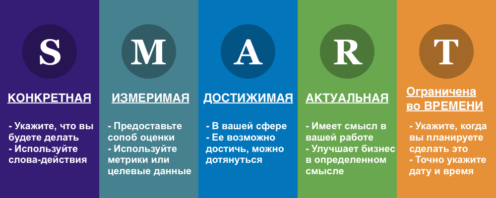

---

## Чек-лист определения проекта

Чек-лист определения проекта поможет понять, точно ли определена суть
вашего проекта и готовы ли вы приступать к следующему этапу — планированию

Если вы обнаружили, что ваш проект определен недостаточно
четко, выберите один из следующих вариантов действий:

- проведите дополнительные обсуждения с ключевыми стейкхолдерами
- устраните их на фазе планирования
- относитесь к ним как к рискам или проблемным моментам проекта

---

## Чек-лист определения проекта

- **Цель запуска проекта:**
    - Понимание, зачем проект запускается

- **Желаемые результаты:**
    - Четкое представление о конечном результате

- **Вписывание в организационный ландшафт:**
    - Как проект интегрируется в существующие процессы

---

## Чек-лист определения проекта

- **Финансирование:**
    - Существует ли критическое расхождение между доступным и необходимым бюджетом?

- **Факторы успеха:**
    - Определены ли все факторы успеха и являются ли они SMART-факторами?
    - Соответствуют ли будущие целевые показатели критериям SMART?

- **Анализ текущего и желаемого состояния:**
    - Задокументирована ли разница между текущим состоянием и желаемым будущим?
    - Как ожидаемые изменения повлияют на бизнес-процессы, клиентов и системы?

---

## Чек-лист определения проекта. Рамки проекта

- **Границы и интерфейсы:**
    - Определяют ли рамки границы между процессами, системами и организациями?
    - Выявлены ли внешние процессы и интерфейсы, на которые проект влияет?

- **Четкость и контроль:**
    - Достаточно ли четко установлены рамки, чтобы быстро обнаружить их размывание?
    - Проанализированы ли рабочие процессы между подразделениями?

- **Организационные и географические аспекты:**
    - Четко ли определены организационные и географические границы?

---

## Чек-лист определения проекта. Рамки проекта

- **Объём проекта:**
    - Включены ли элементы, которые выходят за рамки проекта?
    - Включены ли необходимые инициативы для полной поддержки проекта?
    - Утверждены ли включенные требования?

- **Ограничения и допущения:**
    - Определены ли все ограничения проекта?
    - Идентифицированы ли все допущения?

- **Стандарты и нормативы:**
    - Соблюдаются ли применимые правила, нормы и стандарты (в поставках, качестве, безопасности, законодательстве и т.д.)?

---

## Чек-лист определения проекта
Стейкхолдеры

- **Спонсор проекта:**
    - Определён и вовлечён ли спонсор проекта?

- **Проектная команда:**
    - Представлены ли все затрагиваемые подразделения и бизнес-процессы?
    - Включены ли все группы клиентов?

- **Организационная схема:**
    - Отмечены ли все стейкхолдеры и их отношения подотчетности?
    - Описаны ли проектные роли и присвоены каждому стейкхолдеру?

- **Руководящий комитет и контроль:**
    - Определены ли стейкхолдеры, формирующие руководящий комитет?
    - Определены ли лица, ответственные за проверку и одобрение изменений в содержании проекта?

---

## Чек-лист определения проекта
Подход к проекту

- Обоснование выбора:
    - Объясняется, почему именно этот подход выбран из всех альтернатив.

- Документация:
    - Задокументированы предлагаемые технологии, стратегии и методологии.

---

## Чек-лист определения проекта
Другое

- **Элементы PDD:**
    - Задокументированы ли все элементы определения сути проекта?
    - Соответствует ли PDD принципам управления конфигурацией (версионность)?

- **Управление рисками:**
    - Идентифицированы ли серьезные риски и определены ли стратегии реагирования?

- **Сроки и бюджет:**
    - Указаны ли предварительные сроки и бюджет?
    - Задокументированы ли обоснования причин и допущения для этих показателей?

---

## Чек-лист определения проекта
Согласование

- Все ли стейкхолдеры проверили, согласовали и одобрили PDD?
- Были ли официально согласованы проект и менеджер проекта?

---

# КОРОТКО О ГЛАВНОМ

- **Определение проекта:**
    - Четко сформулированный проект значительно повышает шансы на успех.

- **Утверждение:**
    - Проект и менеджер проекта должны быть официально объявлены и утверждены.

- **Документ PDD:**
    - Основной инструмент управления, объясняющий:
        - Зачем запускается проект;
        - Цели, ожидаемые результаты и границы работ;
        - Кто вовлечён и как измеряется успех.

- **Визуальные инструменты:**
    - Краткий обзор проекта и организационная схема помогают наглядно представить определение проекта.

---

# КОРОТКО О ГЛАВНОМ

- **Навыки менеджера:**
    - Эффективные переговоры и посредничество между стейкхолдерами.

- **Адаптивность:**
    - PDD — «живой» документ, любые изменения в котором должны быть одобрены ключевыми стейкхолдерами.

- **Стейкхолдеры:**
    - Все участники проекта выявлены заранее и должны утвердить PDD.

---

## Чек-лист определения проекта

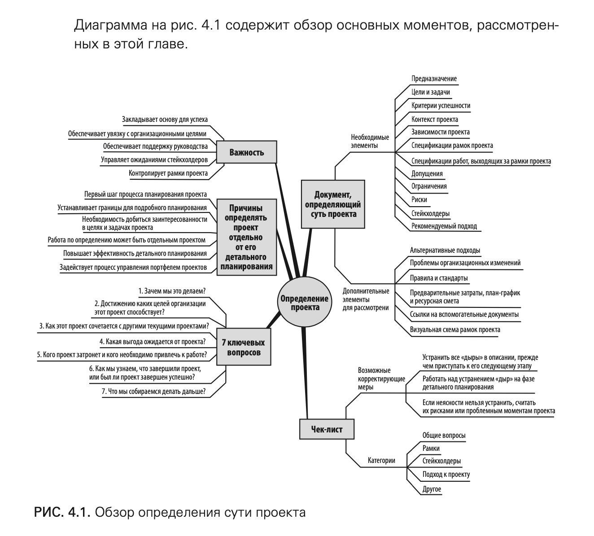

---

# ПЛАНИРОВАНИЕ ПРОЕКТА

- Определение основных принципов эффективного планирования проектов.
- Выделение ключевых вопросов, на которые отвечает планирование.
- Различие плана проекта от формальных файлов, например, Microsoft Project.
- Методы разработки плана проекта.
- Способы предотвращения распространенных ошибок при планировании.

---

## ПЛАНИРОВАНИЕ ПРОЕКТА

 

> Самый популярный способ планирования — использование ме-
тода набегающей волны. Он предполагает, что вы планируете работу в деталях лишь
для следующей фазы проекта. Планирование же последующих фаз проводится на
высоком, то есть не на столь подробном уровне. В ходе процесса завершения и оцен-
ки текущей фазы планируются рабочие детали следующей фазы.

---

## Основные принципы планирования проекта

> Хотя большинство людей как минимум признают ценность планирования,
многие привержены этому лишь на словах. Почему?  
> Как правило, это связано с тем, что процесс планирования, с которым они уже сталкивались
на практике, нарушал один или несколько основных принципов.

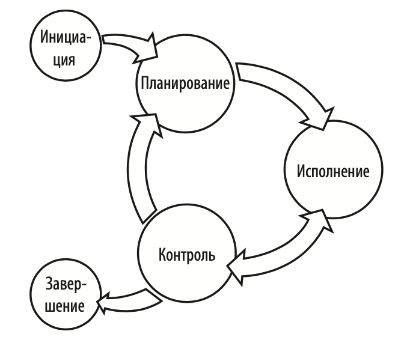

---

## Кратко о ключевых моментах

- **Цель:**  
  Разработать план для выполнения и контроля проекта.

- **Итеративность:**  
  Планирование — непрерывный процесс с несколькими итерациями, согласованием входных данных и мнений стейкхолдеров.

- **Адаптация:**  
  План корректируется в ходе реализации для решения возникающих проблем.

- **Формат:**  
  План проекта — это не просто файл расписания (Microsoft Project) или структура декомпозиции работ (WBS).

---

## Кратко о ключевых моментах

- **Контроль за одним фактором:**
    - Проектная команда самостоятельно определяет один ключевой фактор успеха (рамки, время, затраты или детали выполнения).
    - Высшее руководство задаёт ориентиры, но параметры конкретного фактора вырабатываются командой.

- **Проактивный проектный менеджмент:**
    - Эффективное планирование создаёт условия для проактивного управления.
    - Определяются подходы к управлению коммуникациями, ответственностями, качеством, рисками, поставками и реакцией на отклонения от плана.

---

## Кратко о ключевых моментах

 

- Планирование проекта — это совместное обсуждение и анализ ожиданий всех стейкхолдеров с активным вовлечением 
команды для реального определения методов управления изменениями и рисками, а не навязывание показателей сверху.

---

## Важные вопросы, на которые должно отвечать планирование проекта
Планирование проекта – Основное

- **Определение целей и ожиданий:**  
  Зачем выполняется проект, что будет получено, кто ключевые стейкхолдеры (спонсор, потребители).

- **Методология и процессы:**  
  Определение подходов, процессов и задач для достижения конечных результатов.

- **Ресурсы и расписание:**  
  Распределение ролей, необходимых ресурсов, места, времени и стоимости проекта.

- **Управление изменениями и качеством:**  
  Механизмы контроля версий, эскалации проблем, коммуникации и сбора откликов.

- **Риски и контроль:**  
  Выявление рисков, разработка стратегий реагирования и обеспечение безопасности информации.

---

## Важные вопросы, на которые должно отвечать планирование проекта
Примеры вопросов

- Кто за что несет ответственность?
- Как будут контролироваться изменения?
- Как будет обеспечиваться приемлемое качество рабочих процессов и конечных результатов?

---

## Создание плана проекта

1. **Проверка описания проекта:**
    - Подтвердить экономическое обоснование и учесть возможные изменения в сроках и бюджете.

2. **Определение задач и подхода:**
    - Указать планируемые результаты и всю необходимую работу (ссылка на WBS).

3. **Критерии приемки:**
    - Задокументировать требования к результатам и фазам проекта.

4. **Определение ресурсов:**
    - Определить нужные роли, навыки, инструменты и согласовать их доступность (план управления ресурсами).

5. **Выделение ресурсов:**
    - Уточнить доступность, качество и стоимость ресурсов, а также источники их получения.

6. **Оценка работ:**
    - После определения задач и ресурсов оценить объём и сроки (см. главу 7).

--- 

## Создание плана проекта
Пример итоговой таблицы

| Роль                                   | Член команды   | Потребности в обучении                          | Предварительная дата начала | Предварительная дата окончания | Процент задействования |
|----------------------------------------|----------------|-------------------------------------------------|-----------------------------|--------------------------------|------------------------|
| Ведущий технический специалист         | Б. Гейтс       | Разработка продвинутых корпоративных приложений | 01.06.2007                  | 30.10.2007                     | 100 %                  |
| Ведущий специалист по бизнес-процессам | С. Джонс       | Модерирование процесса в PowerPoint             | 01.06.2007                  | 30.10.2007                     | 100 %                  |
| Ведущий разработчик                    | Л. Грегори     | Разработка                                      | 01.06.2007                  | 30.10.2007                     | 80 %                   |
| Ведущий аналитик                       | Л. Морган      | Работа в Rational Test Studio                   | 01.06.2007                  | 30.10.2007                     | 80 %                   |
| Руководитель тестирования              | К. Браун       | Тестирование                                    | 01.06.2007                  | 30.10.2007                     | 70 %                   |
| Аналитик                               | А. Смит        | —                                               | 01.06.2007                  | 30.10.2007                     | 50 %                   |

---

## Создание плана проекта
RACI/RASIC-матрица

> Матрица RACI или матрица ответственности — инструмент для управления отношениями в команде; 
> это таблица, с помощью которой распределяют ответственность, полномочия и роли.

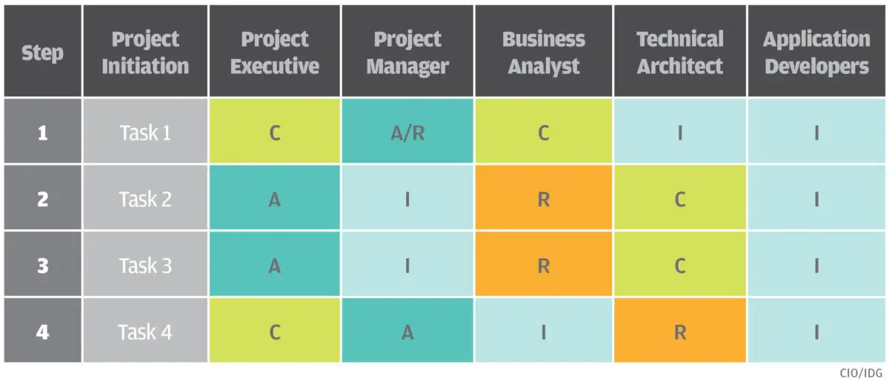

R — ответственный (Responsible)
A — подотчетный (Accountable)
C — консультирующий (Consulted)
I — информируемый (Informed)

---

## Создание плана проекта

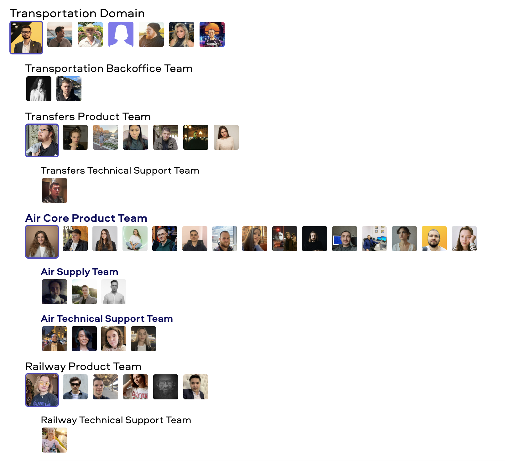

---

## План-график (расписание) проекта
Пример расписания этапов проекта в обобщенном виде, в котором
отслеживаются любые утвержденные отклонения от расписания

| Этап проекта                                    | Первоначальная оценка даты завершения | Пересмотренная оценка даты завершения | Отклонение  |
|-------------------------------------------------|---------------------------------------|---------------------------------------|-------------|
| Завершение фазы планирования                    | 30 апреля 2007 г.                     | 10 мая 2007 г.                        | Неделя      |
| Завершение фазы разработки технического решения | 15 июня 2007 г.                       | 1 июля 2007 г.                        | Две недели  |
| Завершение итерации 1-й разработки              | 15 июля 2007 г.                       | 25 июля 2007 г.                       | Десять дней |
| Завершение итерации 2-й разработки              | 15 августа 2007 г.                    | 20 августа 2007 г.                    | Пять дней   |
| Завершение нагрузочного тестирования            | 1 сентября 2007 г.                    | 10 сентября 2007 г.                   | Девять дней |
| Завершение этапа подготовки и запуска в пилот   | 15 сентября 2007 г.                   | 18 сентября 2007 г.                   | Три дня     |
| Окончание пилотного запуска                     | 1 октября 2007 г.                     | 8 октября 2007 г.                     | Неделя      |
| Завершение этапа внедрения                      | 15 ноября 2007 г.                     | 1 декабря 2007 г.                     | Две недели  |
| Завершение проекта                              | 1 декабря 2007 г.                     | 15 декабря 2007 г.                    | Две недели  |

---

## Создание плана проекта
Фрагмент структуры распределения ролей для проекта по разработке программного обеспечения

| Роль на проекте                      | Обязанности                                                                                                                                                                       | Член команды, назначенный на роль |
|--------------------------------------|-----------------------------------------------------------------------------------------------------------------------------------------------------------------------------------|-----------------------------------|
| **Спонсор проекта**                  | - Продвижение необходимости запуска проекта и разъяснение его аспектов высшему руководству - Полномочия по утверждению изменений и финансированию проекта                      | T. Террифик                       |
| **Менеджер проекта**                 | - Руководство проектом и надзор за ним - Взаимодействие со стейкхолдерами на старте и в ходе реализации - Ответственность за планирование, бюджет, риски, мотивацию команды | M. Менеджер                       |
| **Технический руководитель проекта** | - Разработка и внедрение технических решений - Контроль актуальности используемых технологий                                                                                   | B. Гейтс                          |
| **PM по качеству**                   | - Контроль качества процессов и результатов - Обеспечение удовлетворённости заказчиков                                                                                         | H. Нида                           |
| **Аналитик бизнес-процессов**        | - Анализ бизнес-процессов - Сбор требований - Формирование предложений и оценка эффекта                                                                                     | C. Джонс                          |

---

## План управления изменениями
Схема организационной структуры проекта по разработке ПО, выполняемой внешним подрядчиком

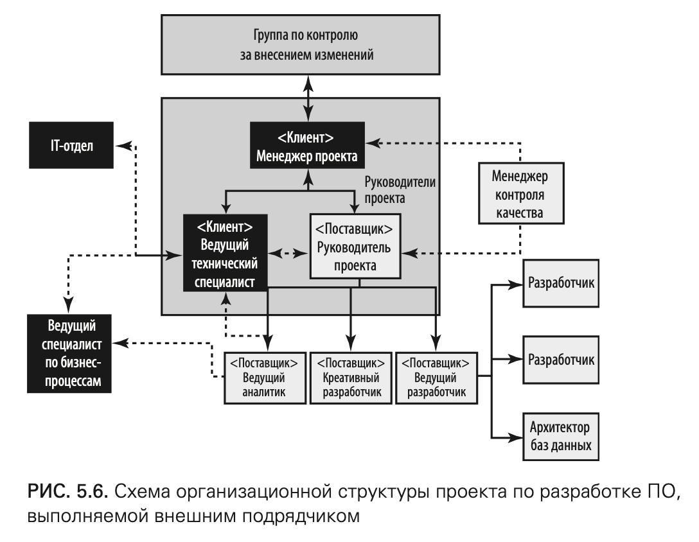

---

## План управления изменениями

- **План управления изменениями:**
    - Определяет процедуры рассмотрения, оценки и утверждения изменений, влияющих на рамки, качество, сроки и бюджет.

- **План хранения и обмена информацией:**
    - Определяет расположение репозитория, доступ и контроль версий, а также процесс управления изменениями конечных результатов.

- **План устранения проблем:**
    - Предусматривает отслеживание проблем и эскалацию критических вопросов на уровень высшего руководства.

- **План управления качеством:**
    - Устанавливает стандарты и процедуры, влияющие на дополнительные роли, задачи и бюджет.

- **План коммуникаций:**
    - Определяет информационные потребности стейкхолдеров и учитывает трудозатраты, связанные с коммуникациями (включая их в WBS).

- **План управления командой:**
    - Уточняет потребности в обучении и методы оценки результативности работы участников проекта.

---

## Краткий обзор дополнительных компонентов плана проекта

| **Компонент**               | **Назначение**                                                                | **Ключевые элементы/Применение**                                                                 | **Влияние на планирование**                                                                              |
|-----------------------------|-------------------------------------------------------------------------------|--------------------------------------------------------------------------------------------------|----------------------------------------------------------------------------------------------------------|
| План управления изменениями | Регламентирует порядок внесения и утверждения изменений в проект              | Описывает факторы, влияющие на рамки, качество, сроки, бюджет и процедуру согласования изменений | Позволяет вовлечь нужных стейкхолдеров и вовремя реагировать на изменения                                |
| План управления информацией | Определяет, где хранится и как распространяется информация по проекту         | Репозиторий, доступ, контроль версий, формат и частота коммуникаций                              | Упорядочивает потоки информации, влияет на структуру взаимодействия и принятие решений                   |
| План контроля проблем       | Устанавливает порядок выявления, отслеживания и эскалации проблем             | Процедуры эскалации, критерии критичности, каналы уведомлений                                    | Помогает своевременно решать проблемы и сохранять ход проекта                                            |
| План коммуникаций           | Определяет, как и когда информация передается стейкхолдерам                   | Матрица коммуникаций, каналы, частота, ответственность                                           | Учитывает трудозатраты на коммуникации, влияет на расписание и взаимодействие с заинтересованными лицами |

---

## Краткий обзор дополнительных компонентов плана проекта

| **Компонент**               | **Назначение**                                                                | **Ключевые элементы/Применение**                                                                 | **Влияние на планирование**                                                                              |
|-----------------------------|-------------------------------------------------------------------------------|--------------------------------------------------------------------------------------------------|----------------------------------------------------------------------------------------------------------|
| План управления качеством   | Задает стандарты и процедуры для поддержания качества результатов и процессов | Методы проверки качества, критерии приемки, инструменты контроля                                 | Дополнительные задачи и роли в WBS, влияет на бюджет и сроки                                             |
| Матрица распределения ролей | Показывает роли и зоны ответственности (RACI или аналог)                      | Уточняет, кто что делает и за что отвечает                                                       | Обеспечивает учет необходимых ресурсов и компетенций                                                     |
| План управления ресурсами   | Описывает потребность в ресурсах, их доступность и порядок привлечения        | Тип и объем ресурсов, сроки использования, источники получения                                   | Влияет на расходы, расписание и структуру команды                                                        |
| План управления рисками     | Выявляет риски, стратегии реагирования и мониторинг                           | Регистр рисков, вероятность и влияние, планы реагирования                                        | Помогает оптимизировать сроки, бюджет и объем работ                                                      |
| План приемки                | Определяет критерии приемлемости результатов и фаз проекта                    | Критерии, процедуры и ответственные за приемку                                                   | Обеспечивает прозрачность требований к конечным результатам                                              |

---

## Чек-лист по проектному плану

- **Важные вопросы:**
    - Ответили ли вы на все вопросы из раздела «Важные вопросы, на которые должно отвечать планирование проекта»?

- **Сверка с WBS и оценками:**
    - Проверили ли вы структуру WBS, оценки трудозатрат, расписание и бюджет с соответствующими чек-листами?

- **Утверждение плана:**
    - Был ли рассмотрен и формально утвержден план проекта?

- **Общее собрание:**
    - Согласовали ли план проекта на общем собрании? Подтвердили ли его все стейкхолдеры лично?

---

# Коротко о главном

- **Разделение:**  
  Описание проекта показывает, **что** нужно достичь, а планирование определяет, **как** это будет достигнуто.

- **Объем плана:**  
  План проекта — это всеобъемлющий документ для выполнения и контроля проекта, а не просто файл Microsoft Project.

- **Содержание плана:**  
  В документе описываются задачи, исполнители, сроки, зоны ответственности и способы управления проектом.

- **Адаптивность:**  
  План проекта является «живым» документом, любые изменения должны быть согласованы с ключевыми стейкхолдерами.

- **Роль менеджера проекта:**  
  Требуются навыки посредничества, межличностного общения, ведения переговоров, аналитические и лидерские качества.

- **Одобрение плана:**  
  Все ключевые стейкхолдеры должны его утвердить. Любая форма утверждения без письменной подписи может повышать риск недопонимания.

---

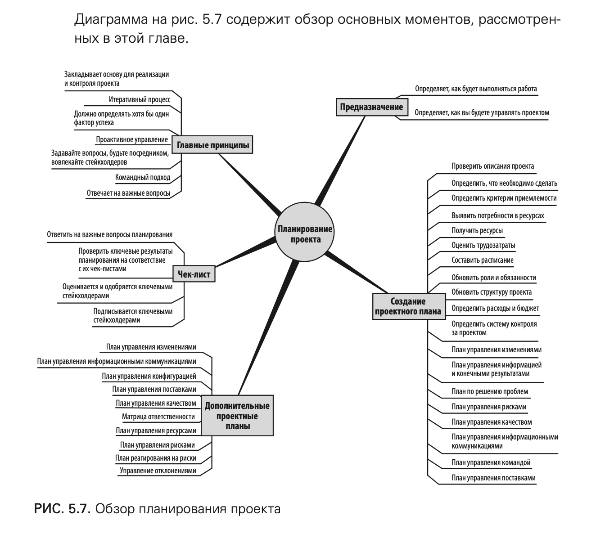

---

# РАЗРАБОТКА СТРУКТУРЫ ДЕКОМПОЗИЦИИ РАБОТ (WBS)

- Понятие и назначение структуры декомпозиции работ (WBS) и её ограничения.
- Причины, по которым WBS считается ключевым инструментом проектного менеджера.
- Основные элементы, составляющие эффективную WBS.
- Способы избежать распространенных ошибок при создании WBS.

---

## Что такое WBS?

> Термин WBS (Work Breakdown Structure) часто переводят на русский язык как «структурная
декомпозиция работ», хотя, строго говоря, акцент должен быть сделан на «структуре».
Соответствующий документ — это именно «СТРУКТУРА декомпозиции работ», а не сама
«декомпозиция».

WBS показывает работу и промежуточные результаты, необходимые для
достижения главных целей проекта, определенных в процессе его описания. 
В большинстве случаев в WBS указываются компоненты, которые
привязаны к конечным результатам, и подход (методологию), используемый
для их разработки, интеграции и проверки. Другими словами, WBS — это
организованный список задач.

---

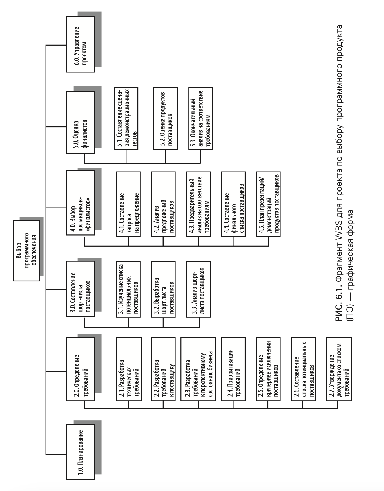

---

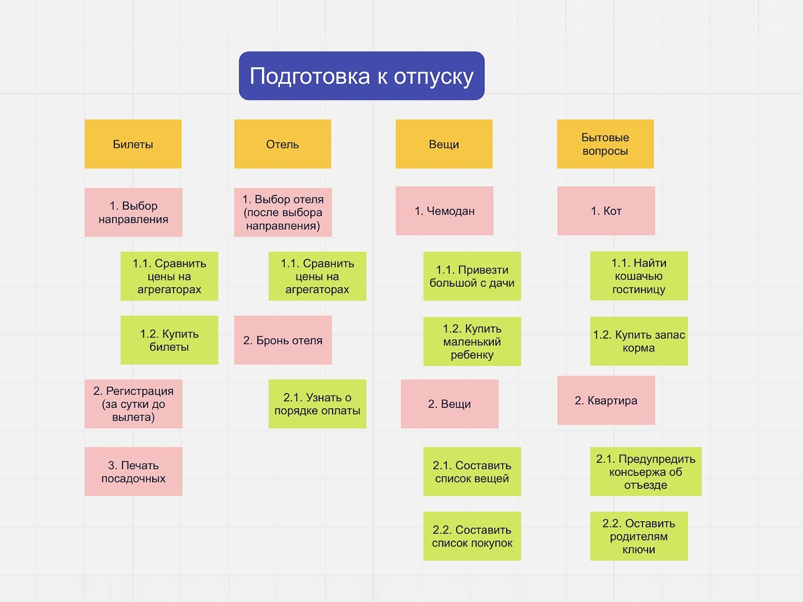

---

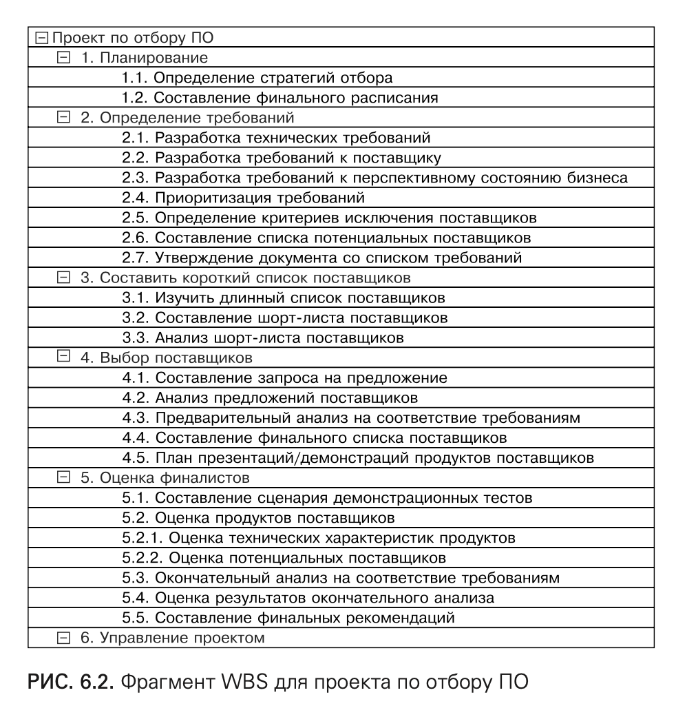

---

## Разве WBS и расписание проекта не одно и то же?

**WBS** представляет собой иерархическую разбивку всего объема работ на меньшие, управляемые задачи, 
что помогает определить границы проекта и распределить ответственность.

**Расписание проекта** устанавливает временные рамки выполнения этих задач, определяя, когда они должны начаться и закончиться, 
и помогает координировать ресурсы и контроль за сроками.

---

### WBS. В чем проблема?

 

- Менеджера Джо просят составить план работ по проекту.
- Джо открывает Microsoft Project и начинает вводить и упорядочивать
задачи, которые необходимо выполнить.
- Джо вводит предварительные сроки, даты начала и окончания самых
важных или обозримых задач.
- Джо отправляет свою работу на оценку своему боссу.

Так что же Джо показал своему начальнику? WBS? В составленном документе перечислены рабочие задачи. Расписание проекта? Он создал
документ в Microsoft Project. План работы? Именно это его и просил подготовить босс. В лучшем случае Джо составил WBS, в которую входят
только высокоуровневые обобщенные (которые состоят из более мелких
частей) рабочие элементы и предварительные графики только основных
этапов проекта. Этот пример показывает, как ненадлежащее планирование
проекта и составление расписания в сочетании с неумелым использованием специализированного ПО может привести к путанице в терминологии.

---

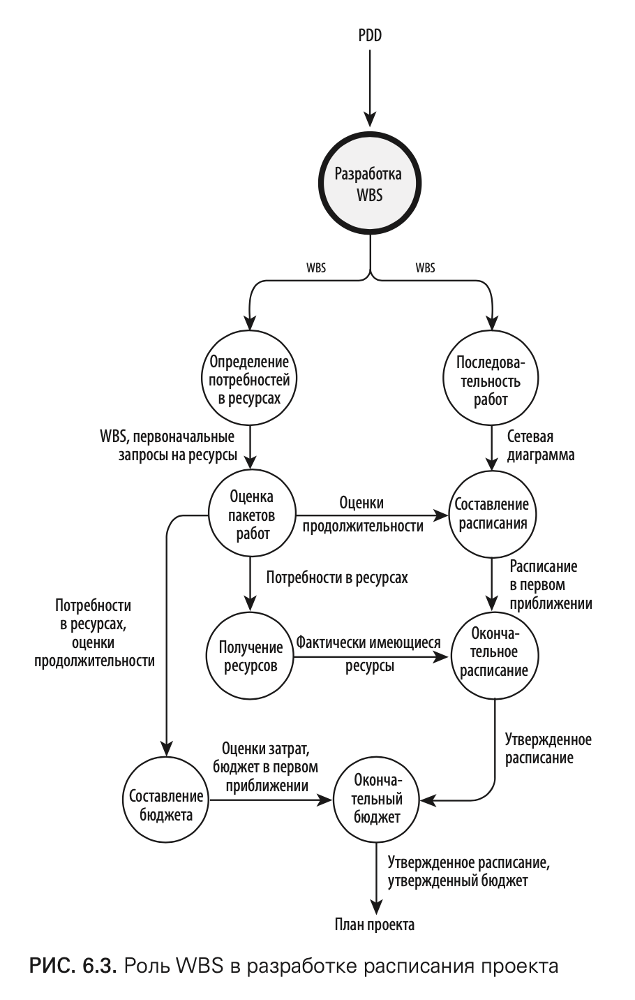

---

# Главные различия между WBS и расписанием проекта

- **Взаимозависимости задач:**
    - **WBS:** Не отображает взаимосвязи между задачами.
    - **Расписание:** Показывает взаимозависимости задач.

- **Запланированные задачи:**
    - **WBS:** Не содержит дат начала и окончания задач.
    - **Расписание:** Включает конкретные временные рамки для каждой задачи.

- **Распределение задач по исполнителям:**
    - **WBS:** Не указывает, кто будет выполнять задачу.
    - **Расписание:** Распределяет задачи между исполнителями.

---

## Типы структур декомпозиции работ

| **Обозначение** | **Описание**                                                               | **Примечания**                                                                                            | **Аналогии из DDD**                                                                                         |
|-----------------|----------------------------------------------------------------------------|-----------------------------------------------------------------------------------------------------------|-------------------------------------------------------------------------------------------------------------|
| **CWBS**        | Контрактная WBS (Contractual Work Breakdown Structure)                     | Определяет уровень отношений между продавцом и покупателем. Используется для управления сделкой.          | Контекстная карта (Context Map) для определения границ взаимодействия между контекстами (Customer/Supplier) |
| **OBS**         | Декомпозиция работ внутри организации (Organizational Breakdown Structure) | Организует задачи по структурным подразделениям, помогает учитывать ответственность и полномочия.         | Бounded Context, отражающий организационные границы                                                         |
| **RBS**         | Декомпозиция работ по ресурсам (Resource Breakdown Structure)              | Сегментирует ресурсы (людей, оборудование, материалы), задействованные в проекте.                         | Aggregate, группирующий связанные сущности и ресурсы                                                        |
| **BOM**         | Ведомость материалов (Bill of Materials)                                   | Отражает физические компоненты (материалы и детали), необходимые для проекта.                             | Value Object, представляющий компоненты без собственной идентичности                                        |
| **PBS**         | Структура декомпозиции продукта (Product Breakdown Structure)              | Разбивает продукт на составные элементы, может использоваться вместе с WBS для более детального описания. | Доменная модель (Domain Model), где каждая часть — это отдельная сущность или поддомен                      |

---

## Почему WBS так важна?

 

> С помощью WBS вы успешно представляете и доносите информацию о работе по проекту до всех стейкхолдеров. Хорошо составленная
WBS обеспечивает проектному менеджеру следующие преимущества.

---

# Преимущества использования WBS

1. **Управление частями вместо целого:**
    - WBS помогает разбить проект на управляемые рабочие пакеты, упрощая координацию даже в масштабных и сложных проектах.

2. **Сокращение числа упущенных задач:**
    - Включает только необходимые работы, исключая лишние и предотвращая внезапные «неучтённые» задачи.

3. **Точность планирования:**
    - Повышает качество оценок по срокам, затратам и ресурсам.

4. **Усиленный контроль:**
    - Обеспечивает основу для оценки и контроля прогресса по каждому рабочему пакету.

5. **Чёткое распределение обязанностей:**
    - Упрощает назначение ответственности как на индивидуальном, так и на организационном уровне.

---

# Преимущества использования WBS

6. **Вовлечение стейкхолдеров:**
    - Структурированное представление работ помогает им лучше понимать рамки проекта и объём требуемых трудозатрат.

7. **Интеграция управленческих задач:**
    - Работы напрямую связываются с расписанием, бюджетом и планами по ресурсам.

8. **Улучшение командной работы:**
    - Ясная картина вклада каждого участника повышает мотивацию и согласованность действий.

9. **Ранняя идентификация рисков:**
    - Детальное декомпозирование задач помогает выявлять потенциальные проблемы ещё на этапе планирования.

10. **Повышенная уверенность в успехе:**
- Чётко структурированный и выполнимый объём работ укрепляет уверенность команды и стейкхолдеров.

---

## Процесс построения WBS

- **Суть декомпозиции:**
    - Разделение проекта на отдельные элементы (работы) кажется логичным, но в процессе создания WBS часто возникают два вопроса: **«С чего начать?»** и **«Когда остановиться?»**

- **С чего начать?**
    - Использовать готовый шаблон WBS (при наличии).
    - Определить основные конечные результаты и подход к проекту (жизненный цикл, фазы).
    - Представить проект целиком и подумать, что будет в итоге.
    - Разложить уже определённые элементы на более мелкие части, если это необходимо.
    - Учесть способы достижения результатов (процессы, методы) и требования к качеству.
    - Убедиться, что текущий уровень детализации позволяет оценить сроки и затраты.

---

## Рекомендации по выработке эффективной WBS

- **Полнота:** Включить все работы, необходимые для достижения конечных результатов.
- **Фокус на результат:** Каждый элемент WBS должен напрямую приводить к конкретному итоговому результату.
- **Совместная разработка:** Создавать WBS с участием команды и обновлять его по мере выполнения проекта.
- **Иерархичность:** Применять нисходящую декомпозицию — каждый элемент имеет только одного родителя, а верхние уровни отражают основные фазы.
- **Отчетность:** Присваивать уникальные идентификаторы для интеграции с системами управления затратами и ресурсами.
- **Интеграция:** Включить в WBS задачи по управлению, интеграции компонентов и внешней работе.
- **Глубина:** Определять уровень детализации в зависимости от рисков, требований к отчетности и баланса "контроль – издержки".
- **Рабочие пакеты:** Нижний уровень WBS — это работа, на основе которой рассчитываются трудозатраты и расходы.

---

## Знать, когда остановиться в разработке WBS

- **Оценка элементов нижнего уровня:**
    - Можно ли оценить затраты, включить в расписание, назначить ответственность?

- **Необходимость детализации:**
    - Нужно ли больше деталей для расчета трудозатрат, распределения работ, отслеживания расходов и контроля хода проекта?

- **Правила объема работы:**
    - Применять правило 8/80 (8–80 часов) или 4/40 (4–40 часов).

- **Критерии для дальнейшей декомпозиции:**
    - Работа не укладывается в стандартный отчетный период.
    - Сопутствующие специфические риски.
    - Ответственность нескольких сотрудников/групп.
    - Более одного результата или рабочего процесса.
    - Наличие времени простоя или превышение доступных ресурсов.

- **Заключение:**
    - Корректность и полнота WBS напрямую влияет на точность оценки ресурсов, трудозатрат и планирования работ.

---

# КОРОТКО О ГЛАВНОМ

- **WBS** — логическая декомпозиция всех работ по проекту.
- Не является расписанием проекта или проектным планом.
- Создается совместно с проектной командой.
- Является важным инструментом проектного менеджера.
- Не спешите с выводами о текущих процессах до анализа их причин.
- Позволяет правильно оценивать работы и избегать типичных ошибок.
- Служит основой для составления расписания, определения ресурсов и бюджета.

---

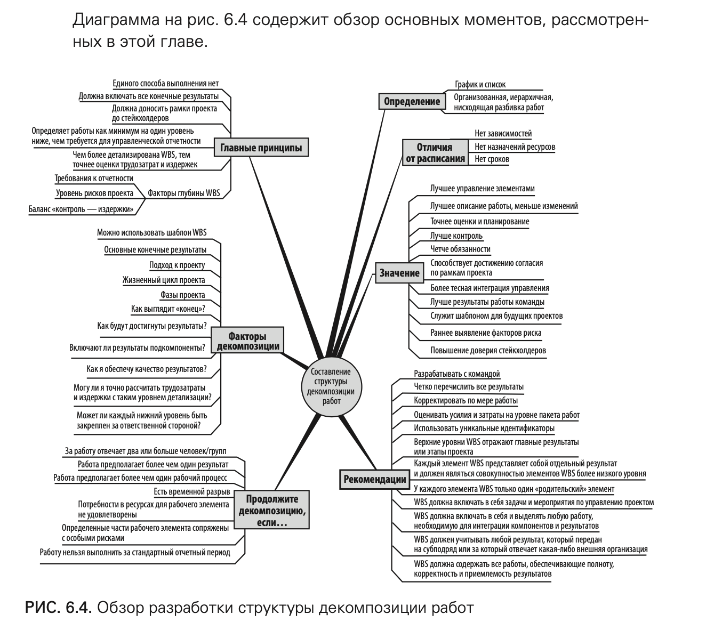

---

# ОЦЕНКА РАБОТ
Суть оценки работ по проекту

- Оценка работ напрямую влияет на успех проекта.
- Процесс оценки помогает управлять рисками.
- Анализ причин плохих оценок и способы их предотвращения.
- Обзор основных методик и методов оценки, включая эффективность метода восходящей оценки.
- Определение необходимой информации для точной оценки.
- Работа в условиях неопределенности.
- Лучшие практики оценки успешных проектов.

---

## Следующий шаг в процессе составления расписания

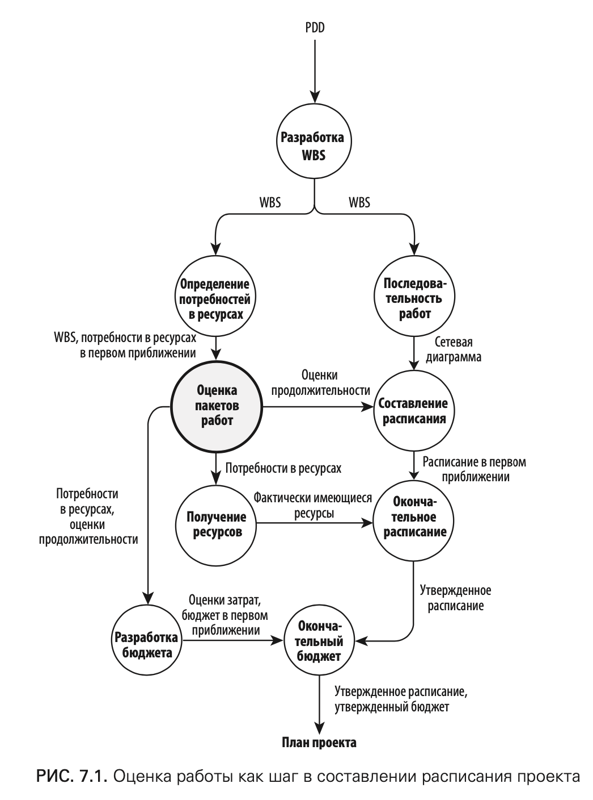

---

## Следующий шаг в процессе составления расписания

 

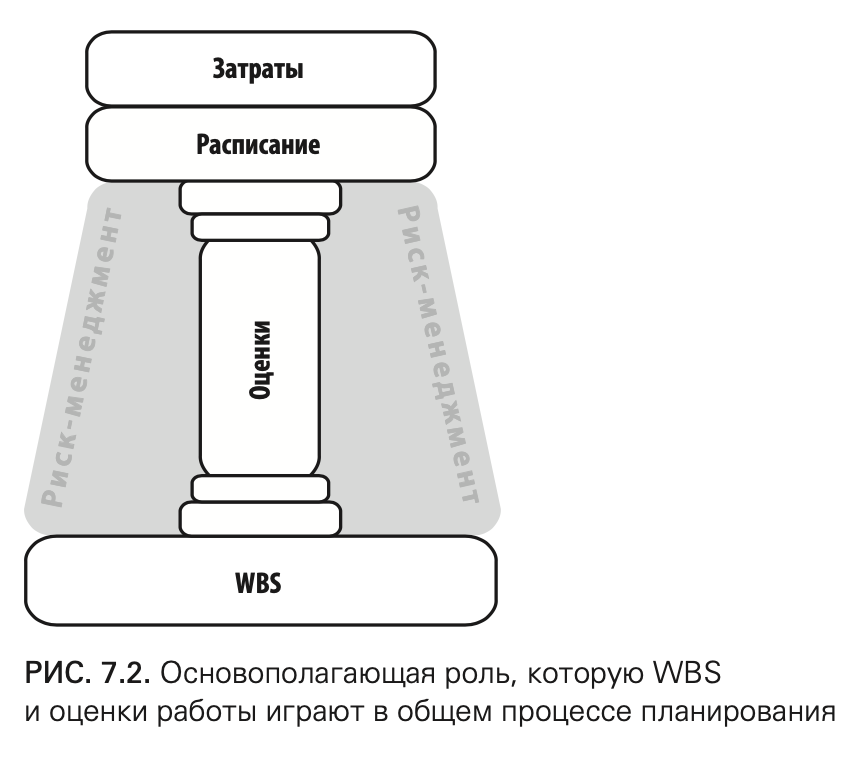

---

## Управление рисками, управление оценками

 

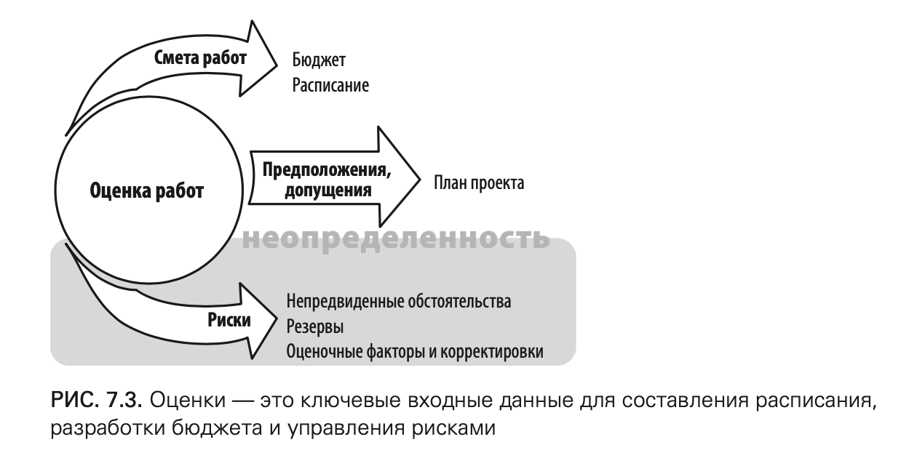

---

## Причины проблем и ошибок в оценках

- **Неполное описание работы:**
    - Оценки на основе приблизительных/неполных требований, незавершенной работы, недостаточной детализации и несоответствия стандартам.

- **Оценка не теми людьми:**
    - Оценки, проведённые без участия опытных специалистов или без проверки экспертами.

- **Плохое коммуницирование:**
    - Недостаток информации, непроверенные допущения, отсутствие обмена данными между стейкхолдерами.

---

## Причины проблем и ошибок в оценках

- **Неверные методики:**
    - Использование неправильных подходов (низходящие оценки, отсутствие диапазона оценок, невовлеченность команды).

- **Проблемы с ресурсами:**
    - Ошибки из-за несоответствия ресурсов, материалов или инструментов требованиям проекта.

- **Отсутствие резервов:**
    - Неучтенные риски и неопределенности, отсутствие буфера для непредвиденных обстоятельств.

- **Решения руководства:**
    - Давление на занижение оценок, несоответствие ожиданий и отсутствие выделения резервов.

---

## Эффективные методики оценки

| **Техника оценки**                   | **Главные характеристики**                                                                                                                                                                              | **Примечания**                                                                                                      |
|--------------------------------------|---------------------------------------------------------------------------------------------------------------------------------------------------------------------------------------------------------|---------------------------------------------------------------------------------------------------------------------|
| **Оценка по аналогии (нисходящая)**  | Используется на ранних этапах планирования, когда есть ограниченная информация по проекту. Опирается на данные о прошлых проектах (фактические результаты) и прогнозирует, исходя из общих аналогий.    | Надёжный метод при недостатке подробной информации. Может служить отправной точкой перед более детальной оценкой.   |
| **Восходящая оценка**                | Построена на детальном анализе работ. Оценивает каждую задачу WBS (пакета работ) снизу вверх.                                                                                                           | Наиболее точный метод. Требует чёткого определения WBS и учёта факторов рисков и неопределённостей.                 |
| **Оценка распределения трудозатрат** | Анализирует процентное соотношение фаз проекта: инициация, планирование, выполнение, завершение и т.д.                                                                                                  | Применяется в организациях, использующих типовую методологию или имеющих исторические данные о распределении работ. |
| **Эвристическая оценка**             | Базируется на опыте и эмпирических правилах (например, метод Delphi). Часто используется, когда отсутствуют точные данные о прошлых проектах.                                                           | Отлично подходит для ситуаций, где нужна экспертная оценка и у команды нет конкретных исторических данных.          |
| **Параметрическая оценка**           | Использует количественные данные (например, строки кода, число функциональных точек, объём строительных материалов). Оценивает трудозатраты и стоимость, опираясь на историческую статистику и формулы. | Удобна для крупных типовых проектов. Может сочетаться с другими методами для повышения точности.                    |
| **Поэтапная оценка**                 | Разделяет проект на фазы, даёт детализированную оценку по мере проработки требований и получения новых данных. Хорошо сочетается с гибкими (agile) подходами.                                           | Подходит для проектов с высокой неопределённостью. Постепенно уточняет прогноз по мере снижения рисков.             |

---

## Эффективные методики оценки

| **Метод оценки**                            | **Главные характеристики**                                                                   | **Примечания**                                                                              |
|---------------------------------------------|----------------------------------------------------------------------------------------------|---------------------------------------------------------------------------------------------|
| **Экспертная оценка**                       | Основана на опыте узкопрофильных специалистов в целевой области.                             | Эффективна в сочетании с нисходящей оценкой.                                                |
| **Информация из прошлых проектов**          | Использует данные о продолжительности предыдущих проектов (файлы, базы данных, опыт).        | Данные должны быть надежно зафиксированы, иначе воспоминания команды могут исказить оценку. |
| **Метод средневзвешенного значения (PERT)** | Использует три оценки (оптимистичную, вероятную, пессимистичную) и рассчитывает среднее.     | Часто применяется в крупных проектах с высокими рисками. Требует времени на расчёты.        |
| **Факторы риска**                           | Корректировка оценок с учетом рисков (сложность работы, орг. изменения, требования).         | Используется вместе с другими методами. Влияет на точность оценки трудозатрат.              |
| **Командная (консенсусная) оценка**         | Включает несколько специалистов для составления независимых оценок и устранения разногласий. | Позволяет учитывать разные точки зрения, снижает субъективность, улучшает точность оценки.  |

---

## Уровни точности оценок

| **Уровень**          | **Диапазон точности** | **Обычно используется**      |
|----------------------|-----------------------|------------------------------|
| **Порядок величины** | От –25% до +75%       | Фаза инициации (определения) |
| **Примерная**        | От –10% до +25%       | Фаза планирования            |
| **Точная**           | От –5% до +10%        | Фаза планирования            |

---

## Лучшие практики оценки работ

 

- **Основывайтесь на WBS**: оценки должны отражать декомпозицию работ.
- **Привлекайте исполнителей**: задачи оценивают люди, которые будут их выполнять.
- **Контролируйте детализацию**: трудозатраты на элемент WBS не должны превышать стандартный отчетный период.
- **Используйте исторические данные и экспертизу**: учитывайте опыт предыдущих проектов и суждения экспертов.
- **Учитывайте характеристики ресурсов и риски**: корректируйте оценки с учётом способностей команды и потенциальных проблем.
- **Задокументируйте допущения**: фиксируйте все предположения в плане проекта.
- **Предоставляйте и запрашивайте ключевую информацию**: контекст (PDD), WBS, критерии качества, диапазон оценки и факторы, влияющие на неё.
- **Добавляйте резервы**: учитывайте время и бюджет для непредвиденных обстоятельств.
- **Опирайтесь на реальные потребности**: оценки не должны искусственно занижаться или завышаться под давлением руководства.
- **Учитесь на прошлых проектах**: собирайте и анализируйте данные, чтобы повышать точность будущих оценок.

---

## Коротко о главном

 

- **Цена точности**: получение точных оценок требует времени и ресурсов.
- **Накопление опыта**: любая методика улучшает результаты при систематическом использовании и учёте прошлых проектов.
- **Сравнение с реальностью**: сопоставление оценок с фактическими результатами выявляет закономерности.
- **Гибкий выбор методов**: можно применять разные методы одновременно, определяя уровень детализации для каждой ситуации.
- **Влияние внешних факторов**: меняющиеся требования, текучка кадров и неудачные технологии могут сделать начальные оценки неточными.
- **Командная работа**: проектный менеджер не должен оценивать работу в одиночку.
- **Организационный приоритет**: компании должны развивать процессы оценки, чтобы повышать их точность со временем.
- **Ответственность стейкхолдеров**: все заинтересованные стороны влияют на формирование и согласование оценок.

---

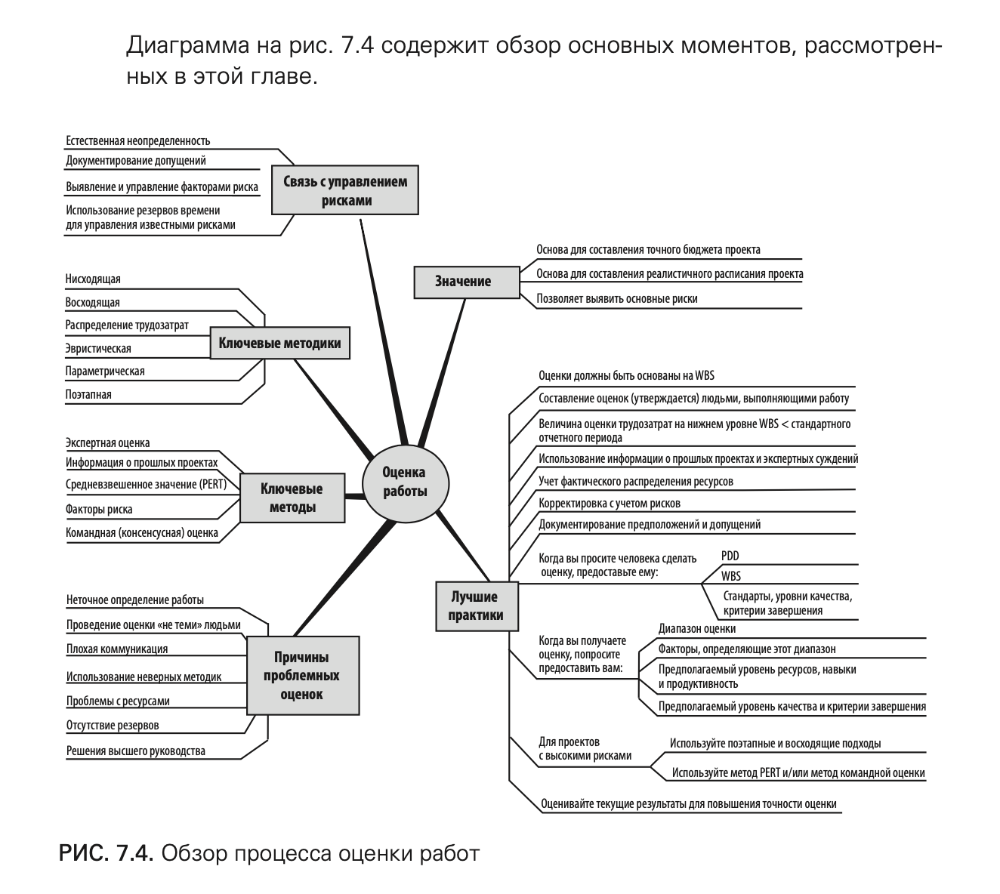

---

# РАЗРАБОТКА ПЛАНА-ГРАФИКА (РАСПИСАНИЯ) ПРОЕКТА

- **Значимость:** Расписание — ключ к успешной реализации проекта.
- **Создание:** Разработка реалистичного, детального и гибкого графика.
- **Характеристики:** Точность, четкость, реалистичные сроки и адаптивность.
- **Ошибки:** Выявление и устранение распространенных ошибок даже опытными менеджерами.
- **Презентация:** Эффективное представление расписания для стейкхолдеров.

---

## Значение проектного расписания

 

> Расписание проекта — это инструмент, который объединяет все рабочие
задачи, их зависимости, приблизительные сроки и выделенные ресурсы.

---

## Расписание проекта отражает:

- Структуру декомпозиции работ (WBS)
- План ресурсов
- Оценки трудозатрат
- Важнейшие контрольные точки
- Распределение ответственности (матрица RASIC)
- План управления качеством
- План управления рисками
- План коммуникаций
- План управления поставками
- План обучения персонала

---

## Расписание проекта
Пример фрагмента расписания в табличной форме

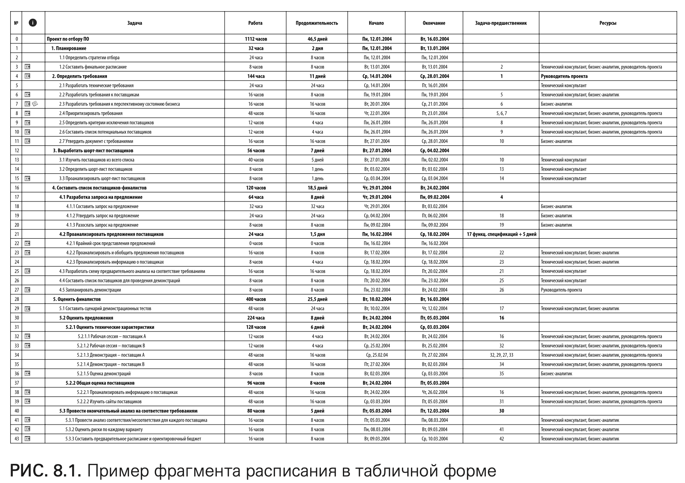

---

## Расписание проекта
Пример фрагмента расписания в форме диаграммы Ганта

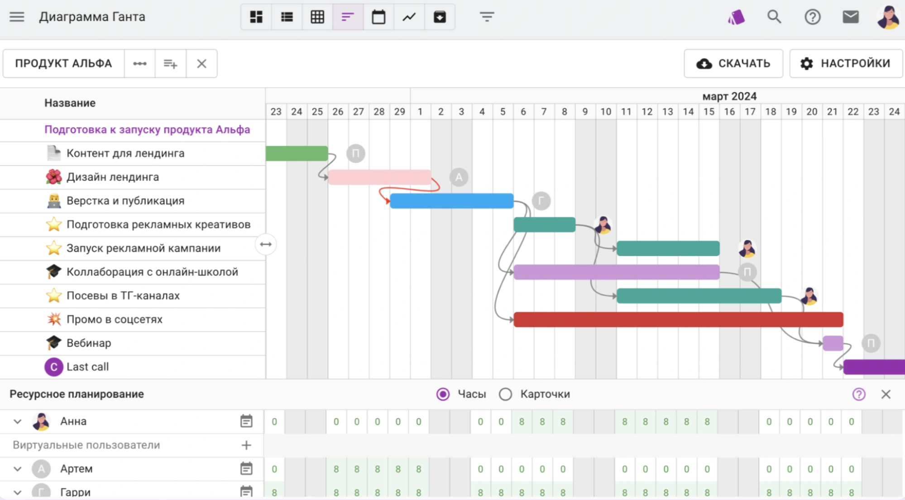

---

## Цель процесса составления расписания

- **Полнота:** Отражает всю работу, которую необходимо выполнить (важна качественная и полная WBS).
- **Реалистичность:** Сроки и время выполнения работ должны быть достижимыми.
- **Согласованность:** Одобрено всеми членами команды и стейкхолдерами.
- **Формальность:** Официально задокументировано как формальный документ.

---

## Ключевые исходные данные для составления расписания

| **Компонент**             | **Описание**                                                                                    | **Примечания**                                                           |
|---------------------------|-------------------------------------------------------------------------------------------------|--------------------------------------------------------------------------|
| **WBS**                   | Систематизированный список задач, отражающий всю работу по проекту.                             | Подробности в главе 6 "Разработка структуры декомпозиции работ (WBS)".   |
| **Оценки трудозатрат**    | Оценка необходимых усилий и времени для выполнения каждой задачи.                               | См. главу 7 "Оценка работ".                                              |
| **Зависимости задач**     | Логические связи между рабочими задачами, определяющие их порядок и взаимосвязи.                | Обсуждаются в текущей главе.                                             |
| **Ресурсы**               | Персонал и оборудование, необходимые для выполнения работ.                                      | Рассматриваются в части II "Планирование проекта".                       |
| **Реагирование на риски** | Меры для смягчения неопределенности в оценках, часто выраженные через резервы времени (буферы). | Обеспечивает устойчивость расписания при непредвиденных обстоятельствах. |

---

## Ключевые исходные данные для составления расписания

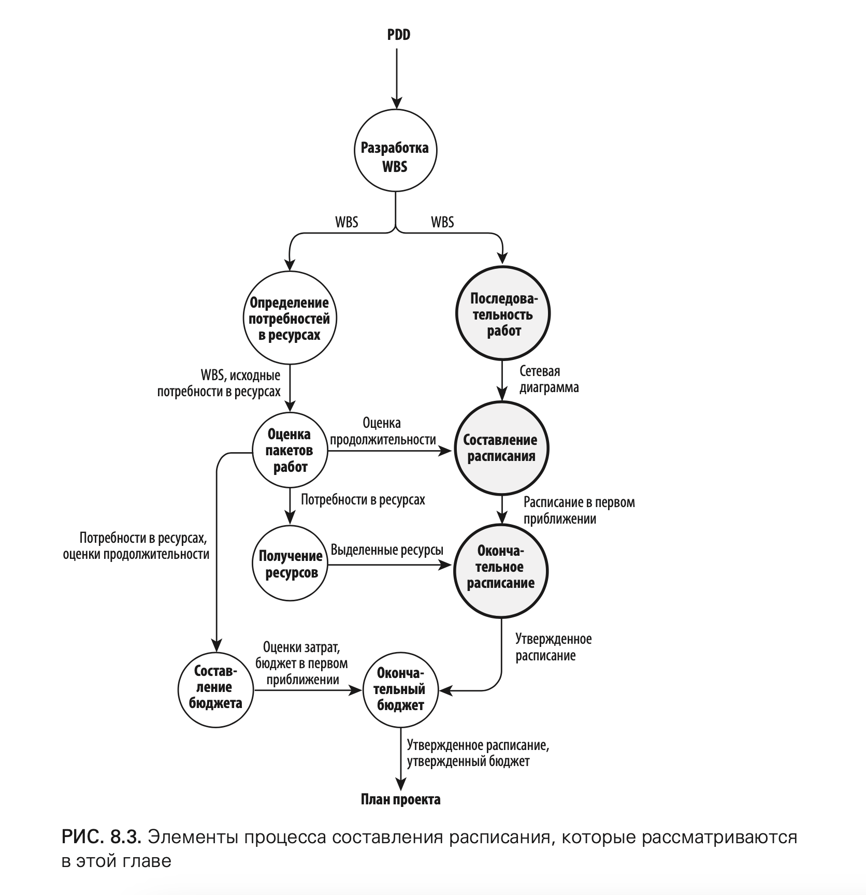

---

## Разработка расписания

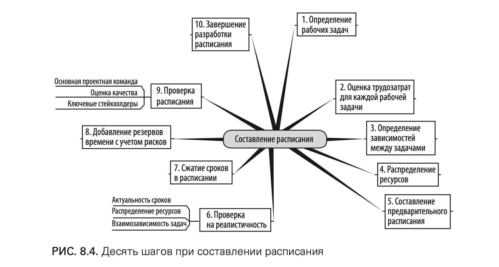

---

## Выявление зависимостей задач (упорядочение работ)
GERT/PERT - метод графической оценки и анализа

> На этом шаге мы определяем, что необходимо выполнить в первую очередь
и что можно выполнять одновременно

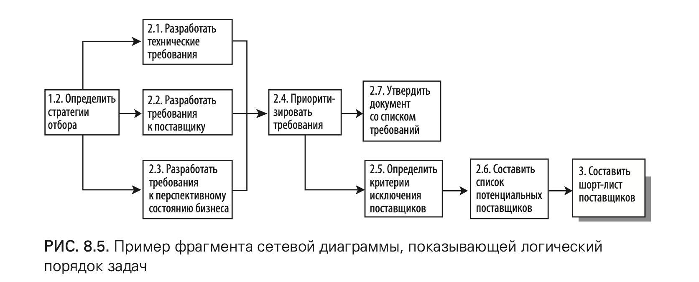

---

## Составление предварительного расписания

> Воспользуйтесь какой-либо программой для календарного планирования, которой вы в должной мере владеете.

- Анализ критического пути.
- Расчет расписания.
- Выравнивание ресурсов.
- Поддержка анализа типа «что, если»
- Поддержка нисходящего планирования.

---

## Проверка на реалистичность

- **Реалистичность расписания:**
  - Проверить соответствие расписания организационной культуре и корректность распределения ресурсов и календарей.

- **Выравнивание ресурсов:**
  - Устранить ошибки в распределении работ и оптимизировать использование ресурсов.
  - Если нагрузка на сотрудника превышает допустимые нормы (например, 16 часов в день), скорректировать ожидания.

- **Варианты корректировки:**
  - Использовать других сотрудников для выполнения задач.
  - Связать задачи последовательно, если их выполняет один человек.
  - Изменить приоритет задачи для автоматического выравнивания.

- **Проверка календарей:**
  - Учесть нерабочие дни и установить корректное количество рабочих часов в день.
  - Составить индивидуальные календари для сотрудников с нестандартным графиком.

---

## Сокращение расписания

| **Метод**                            | **Описание**                                                                                                      | **Особенности**                                                                                                                 |
|--------------------------------------|-------------------------------------------------------------------------------------------------------------------|---------------------------------------------------------------------------------------------------------------------------------|
| **Сжатие**                           | Добавление ресурсов на выполнение только тех задач, которые лежат на критическом пути.                            | Позволяет ускорить проект за счёт увеличения объёмов ресурсов, но может привести к дополнительным расходам и рискам.            |
| **Быстрый проход**                   | Одновременное выполнение задач, лежащих на критическом пути.                                                      | Рискованный способ, повышающий вероятность пересмотров и доработок.                                                             |
| **Модификация процессов**            | Повышение продуктивности за счёт оптимизации внутренних процессов, внедрения новых инструментов или оборудования. | Новые процессы не всегда можно быстро ввести в проект; требуется время и ресурсы на их разработку и обучение команды.           |
| **Использование сверхурочных работ** | Увеличение числа рабочих часов в день или неделю, выделяемых на проект.                                           | Эффективно на ограниченном промежутке времени, однако частое использование может снижать мотивацию команды и ухудшать качество. |

---

## Проверка расписания

1. **Командная оценка:**
  - Обсудить расписание с командой и получить обратную связь по задачам, ресурсам, логике последовательностей и учтённым факторам.

2. **Оценка качества:**
  - По возможности привлечь опытного специалиста по планированию для независимой проверки.

3. **Оценка стейкхолдеров:**
  - Представить расписание ключевым стейкхолдерам, побудить их задавать вопросы и вносить предложения.
  - Важно обеспечить дружелюбную и интерактивную форму презентации.

---

## Презентация расписания

| **Метод**                    | **Ключевые характеристики**                                                                                             | **Преимущества**                                                                                    | **Применения**                                                                                             |
|------------------------------|-------------------------------------------------------------------------------------------------------------------------|-----------------------------------------------------------------------------------------------------|------------------------------------------------------------------------------------------------------------|
| **Диаграмма основных задач** | Сводная диаграмма, показывает укрупнённые даты начала и окончания ключевых этапов.                                      | Отражает точки принятия ключевых решений и ключевые этапы. Удобна для быстрого обновления статуса.  | Подходит для высокоуровневого обзора проекта, презентации руководству или внешним стейкхолдерам.           |
| **Диаграмма Ганта**          | Отображает текущий ход работ с учётом взаимосвязей задач, основанных на структуре WBS.                                  | Хорошо знакома большинству участников. Наглядно показывает зависимости и прогресс выполнения задач. | Применяется при детальном планировании, отслеживании сроков и координации ресурсов внутри команды проекта. |
| **Обобщённый Гант**          | Укрупнённая версия диаграммы Ганта с акцентом на ключевые этапы и фазы, включая оценки и графики.                       | Позволяет быстро увидеть критический путь и основные вехи проекта.                                  | Используется в инструментах вроде MS Project (Timeline View) для обзора плана на высоком уровне.           |
| **Сетевая диаграмма**        | Визуализирует логику и порядок выполнения задач, включая критический путь.                                              | Даёт чёткое представление о последовательности работ и зависимости между ними.                      | Полезна при детальном анализе проекта, планировании и поиске путей оптимизации графика.                    |
| **Диаграмма на основе WBS**  | Использует структуру декомпозиции работ (WBS) в качестве основы, сохраняя иерархические связи между элементами проекта. | Демонстрирует, как задачи связаны с элементами WBS, облегчает контроль полноты работ.               | Сочетается с другими диаграммами (например, Гант), применима для согласования работ с иерархией WBS.       |

---

# КОРОТКО О ГЛАВНОМ

- **Итеративность и командная работа**: Создание расписания требует нескольких итераций и совместных усилий.
- **Важный компонент плана**: Расписание охватывает все ключевые задачи и влияет на бюджет, ресурсы и сроки.
- **Управление ожиданиями**: Самый действенный инструмент согласования сроков, затрат и качества со стейкхолдерами.
- **Исходные данные**: WBS, оценки трудозатрат, зависимости задач, распределение ресурсов и реакции на риски.
- **Реалистичность**: Часто страдает из-за неправильного процесса разработки расписания или неопытности в использовании ПО.
- **Прозрачность**: Все предположения и допущения должны быть задокументированы и доведены до сведения стейкхолдеров.

---

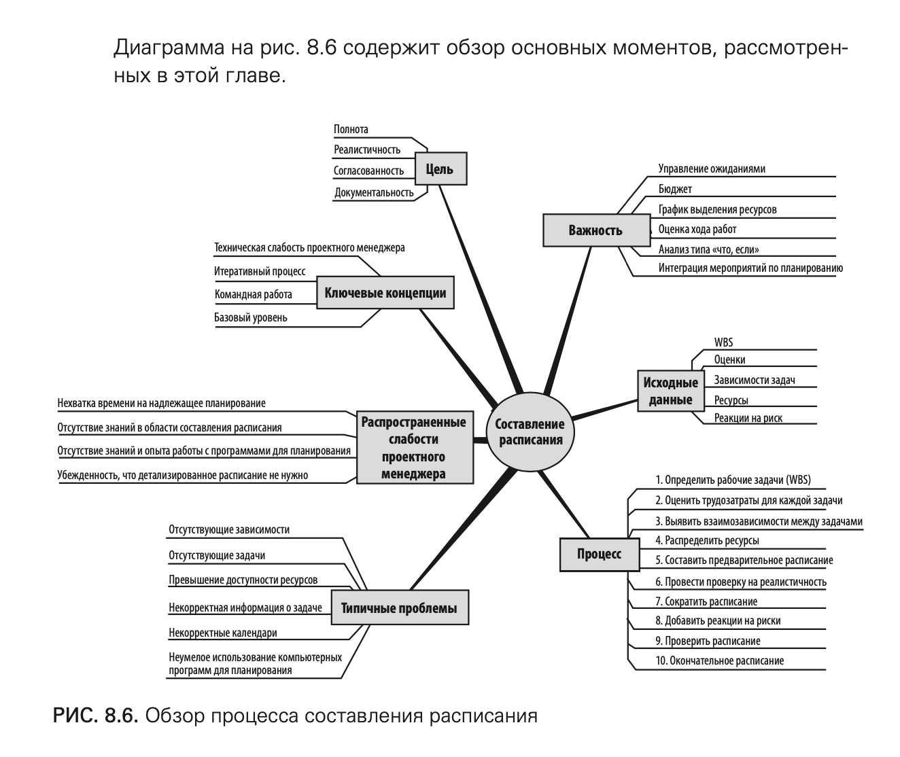

---

## СОСТАВЛЕНИЕ БЮДЖЕТА ПРОЕКТА

- **Значимость бюджета**: Важен для контроля затрат и достижения целей проекта.
- **Процесс составления**: Необходимо разработать реалистичный бюджет, учитывая все источники затрат и риски.
- **Ключевые принципы**: Точность оценок, учет резерва на непредвиденные расходы, связь с планом ресурсов и расписанием.
- **Типичные ошибки**: Недооценка затрат, отсутствие буфера на риски, несогласованность с командой и стейкхолдерами.

---

## Суть составления бюджета проекта

- **Упражнение:**  
  Составление бюджета, даже если это не обязательно, помогает укрепить навыки, выявить проблемы и подготовиться к обсуждению с руководством.

- **Финансирование:**  
  Понять, кто спонсирует проект и принимает финансовые решения, критично для управления ожиданиями.

- **Проверка планирования:**  
  Бюджет, основанный на расписании, служит взаимной проверкой точности обоих инструментов.

- **Оценка и контроль:**  
  Бюджет помогает оценивать ход проекта, управлять денежными потоками и обосновывать инвестиционные решения.

---

## Принципы создания эффективного бюджета

- **Итеративный процесс:**
  - Бюджет разрабатывается через циклы обратной связи с учетом всех аспектов планирования.

- **Жизненный цикл:**
  - Охватывает весь период проекта, включая операционные фазы.

- **Поэтапность:**
  - Определяет, когда и какие затраты возникнут, что важно для управления денежными потоками.

- **Полнота:**
  - Учитывает все расходы, а не только очевидные ресурсы.

- **Резерв:**
  - Включает буфер для рисков, неопределенностей, инфляции и изменений валют.

- **Документация предположений:**
  - Все допущения фиксируются и доводятся до сведения стейкхолдеров.

---

## Составление бюджета проекта

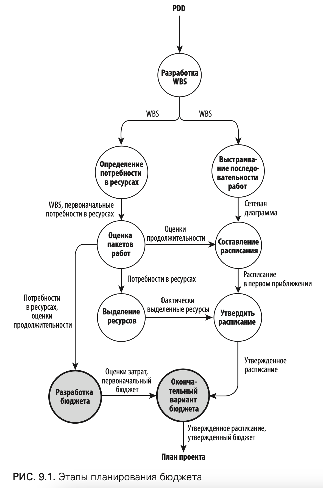

---

## Бюджетные расходы, которые следует учитывать

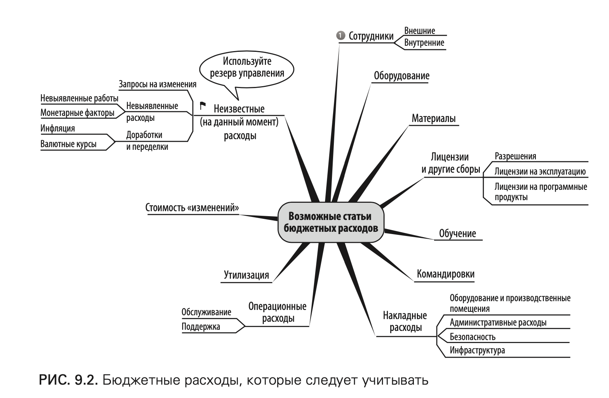

---

## Выработка окончательной версии бюджета

- **Проверка поставок:**
  - Убедитесь, что все задачи по приобретению, доставке, установке и оплате ресурсов включены в WBS и расписание.

- **Согласованность затрат:**
  - Проверьте, что затраты на ресурсы отражают их фактическое использование, даже если нагрузка варьируется по неделям.

- **Расчет затрат на персонал:**
  - Рассчитывайте затраты, умножая почасовую ставку на фактическое рабочее время за период (например, 40 часов × 12 недель).

- **Резерв управления:**
  - Определите и добавьте резерв с учетом известных рисков и отраслевых практик.

---

## Типичные ошибки при составлении бюджета

- **Основа бюджета:**
  - Зависит от полноты WBS, оценки ресурсов, трудозатрат и расписания. Любая неполнота негативно влияет на бюджет.

- **Все категории затрат:**
  - Бюджет должен учитывать все расходы, за которые отвечает проектная команда, включая маржинальность для прибыльных продуктов.

- **Сроки составления бюджета:**
  - Раннее определение бюджета может ограничивать объем работ и доступные ресурсы.

- **Отслеживание затрат на оплату труда:**
  - Часто не производится из-за организационных политик и несоответствия систем учета, что снижает детализацию данных.

---

# КОРОТКО О ГЛАВНОМ

- Если планирование проведено правильно, разработка бюджета становится несложной задачей.
- Бюджет проекта важен для управления ожиданиями, отслеживания прогресса, оценки результатов и управления денежными потоками.
- Эффективный бюджет разбит на этапы, охватывает весь жизненный цикл проекта и учитывает все затраты.
- Бюджет объединяет расписание, планы по ресурсам, поставкам и меры реагирования на риски.
- Точная основа бюджета – это WBS, оценки трудозатрат и расписание проекта.

---

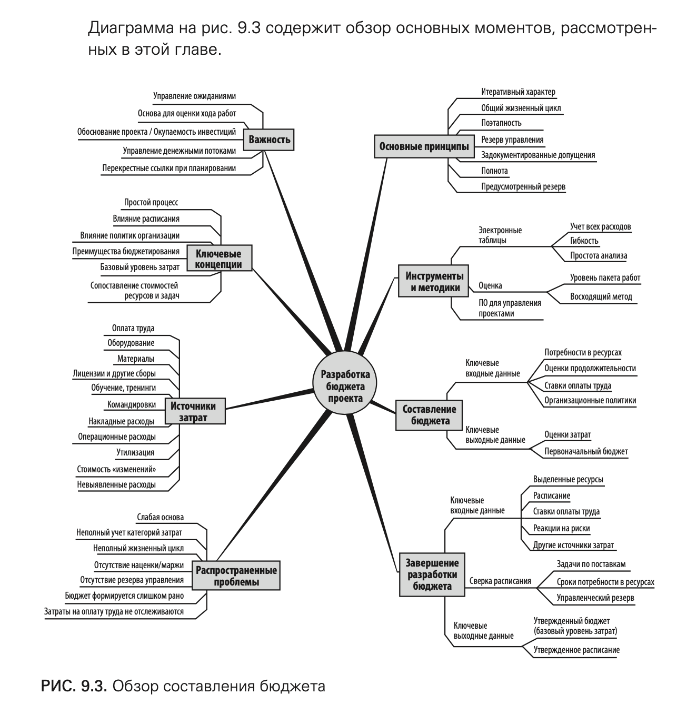

---

# Next steps

> Часть III «Контроль хода выполнения проекта» познакомит с методами, 
> которые позволят вам эффективно отслеживать, контролировать, 
> корректировать и поддерживать продуктивность работ по выполнению проекта.

- почему планирование проекта так важно для его контроля
- принципы эффективной системы контроля проекта
- принципы отчетности о статусе проекта
