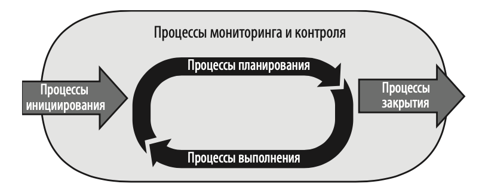
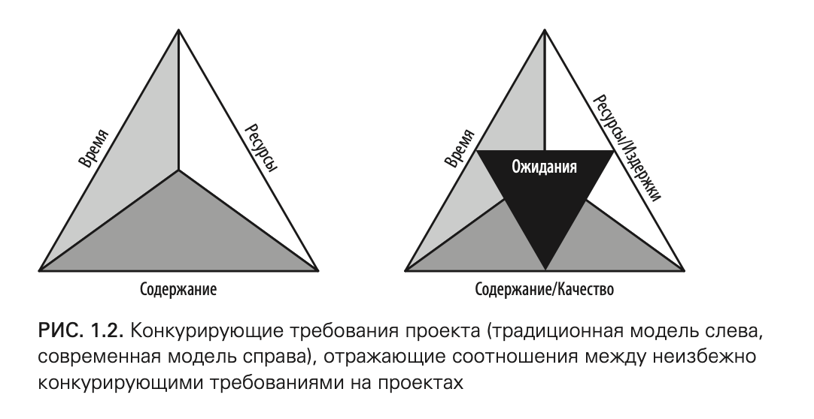
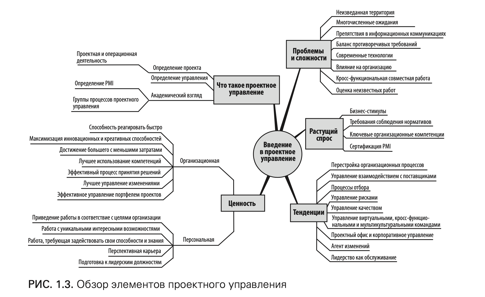

---
# You can also start simply with 'default'
theme: seriph
# random image from a curated Unsplash collection by Anthony
# like them? see https://unsplash.com/collections/94734566/slidev
background: https://cover.sli.dev
# some information about your slides (markdown enabled)
title: УПРАВЛЕНИЕ ПРОЕКТАМИ С НУЛЯ
info: |
  ## Slidev Starter Template
  Presentation slides for developers.

  Learn more at [Sli.dev](https://sli.dev)
# apply unocss classes to the current slide
class: text-center
# https://sli.dev/features/drawing
drawings:
  persist: false
# slide transition: https://sli.dev/guide/animations.html#slide-transitions
transition: slide-left
# enable MDC Syntax: https://sli.dev/features/mdc
mdc: true
---

# УПРАВЛЕНИЕ ПРОЕКТАМИ С НУЛЯ

Автор: Грек Хорин

---

---

# Что в меню

- **Часть 1.** Проектное управление (основы, личные качества)
  - Введение, кто такой менеджер, минимум для успешного проекта

- **Часть 2.** Планирование проекта (про процессы)
  - Что такое проект, как его планировать
  - Декомпозиция/Оценка задач (WBS)
  - Планирование времени/бюджета

- **Часть 3.** Контроль хода выполнения проекта (про методологии)
  - Мониторинг и контроль
  - Управление изменениями
  - Решение проблем по ходу и в конце проекта
  - Управление рисками и качеством

---

# Что в меню

- **Часть 4.** Выполнение работ по проекту (про коммуникации)
  - Управление командой/коммуникациями/ожиданиями
  - повышение эффективности
  - этап завершения проекта

- **Часть 5.** Ускорение обучения (выводы и рекомендации)
  - Microsoft Project ???
  - реальный мир
  - про сертификацию PMP

---

# Введение

> Сегодня организации движутся в сторону управления, ориентированного
на проектную деятельность, чтобы выполнять больше и тратить меньше.

 

> Потребность в талантливых проектных менеджерах постоянно растет.

 

> Все больше людей впервые сталкиваются с необходимостью принимать
решения в этой сфере.

 

> В идеале каждый новый кандидат в проектные менеджеры должен пройти
сертифицированные программы обучения и стажировки, прежде чем приступить 
к своему первому проекту.

---

# Цели

- книга позиционирует себя как руководство для начинающих
- рассказать о базовых принципах управления проектами
- на примерах показать разницу между успешными и неуспешными проектами

---

# Часть 1. Проектное управление. 

- Что такое проектное управление и что им не является
- Почему управлять проектами — непростая задача.
- Почему проектное управление — ключ к будущему росту компании.
- Почему у проектного управления светлое будущее 
  и почему получение сертификата проектного менеджера может 
  быть мудрым шагом в карьере.
- Каковы последние тенденции в проектном управлении, 
  которые могут повлиять на ваши возможности в этой сфере.

---

# Часть 1. Что есть проект?

> Проект — это работа, выполняемая организацией всего один раз для
получения уникального результата. Это означает, что он имеет четко
определенное начало и конец и результат работы отличается от всего,
что организация делала раньше.

 

Примеры проектов:

- Разработка нового программного приложения.
- Оценка текущих производственных процессов.
- Улучшение организационных бизнес-процессов.
- Написание книги.

 

> Институт управления проектами (PMI)1 определяет проект как
временную деятельность для производства уникального продукта или услуги.

---

# Часть 1. Что есть Операционная деятельность?

> Операционная деятельность — это постоянный, повторяющийся набор действий,
которые обеспечивают устойчивое функционирование организации.

 

Примеры операционной деятельности:

- Обработка клиентских заказов.
- Ежедневное производство продукции.
- Технического обслуживания оборудования.

---
hideInToc: true
---

# Часть 1. Сравнение проектов и операционной деятельности

| Признак                    | Проекты                                                                                                                               | Операционная деятельность                                                                      |
|----------------------------|---------------------------------------------------------------------------------------------------------------------------------------|------------------------------------------------------------------------------------------------|
| **Основные сходства**      | Планируются, выполняются и контролируются. Выполняются людьми. Ограничены выделяемыми ресурсами                                       | Планируется, выполняется и контролируется. Выполняется людьми. Ограничена имеющимися ресурсами |
| **Смысл и предназначение** | Достижение поставленных целей, после чего проект считается завершенным                                                                | Стабильная работа организации                                                                  |
| **Время**                  | Ограничено. Есть четкое начало и конец                                                                                                | Не ограничено                                                                                  |
| **Результат**              | Уникальный продукт, услуга или результат                                                                                              | Неуникальный продукт, услуга или результат                                                     |
| **Трудовые ресурсы**       | Динамичные временные команды, которые формируются в соответствии с требованиями проекта. Обычно не входят в организационную структуру | Функциональные команды, которые обычно входят в организационную структуру                      |
| **Полномочия менеджера**   | Зависят от организационной структуры. Прямые распорядительные — обычно в минимальном объеме или вообще отсутствуют                    | Как правило, официальные прямые распорядительные                                               |

 

> Проекты менее предсказуемы, поскольку в большинстве случаев на них постоянно влияет динамичная 
изменчивая природа организационной среды.

---

# Часть 1. Что такое управление проектами?

 

Что мы подразумеваем под «управлением проектами»?

---

# Часть 1. Что такое управление проектами?

Что мы подразумеваем под «управлением проектами»?

 

- планирование, организация, конкретная реализация и контроль проекта
- процесс разработки проекта, воплощения плана в жизнь
- процесс управления противоречащими друг другу требованиями
- управление командой, ресурсами, временем, бюджетом и качеством

 

> PMI определяет проектное управление как применение знаний,
навыков, инструментов и техник к мероприятиям по проекту ради удовлетворения
требований проекта.

---

# Часть 1. Управление проектами. Научный взгляд

 

> PMI, всемирно известная организация по разработке стандартов 
управления проектами (www.pmi.org), определяет проектное управление как набор
из пяти групп процессов и десяти областей знаний.

 

Эта информация взята из шестого издания «Руководства к своду знаний
по управлению проектами» (PMBOK).

---

# Часть 1. Описание групп процессов проектного управления

| №  | Группа процессов      | Описание в PMBOK — шестое издание                                                                                                                                                                    | Общие термины                                                     |
|----|-----------------------|------------------------------------------------------------------------------------------------------------------------------------------------------------------------------------------------------|-------------------------------------------------------------------|
| 1  | Инициация             | Эти процессы выполняются, чтобы определить новый проект или новую фазу существующего проекта через получение разрешения на запуск проекта или этой фазы                                              | «Предварительное планирование», «Запуск проекта»                  |
| 2  | Планирование          | Эти процессы необходимы для определения рамок проекта, уточнения его целей и программы действий. Они нужны для достижения целей проекта                                                              | «Определение», «Разработка плана», «Заложение основ»              |
| 3  | Исполнение            | Эти процессы необходимы для координации людей и ресурсов, требуемых для воплощения плана                                                                                                             | «Осуществление», «Выполнение», «Координация»                      |
| 4  | Мониторинг и контроль | Эти процессы позволяют отслеживать, оценивать и регулировать процесс реализации и эффективность проекта, определять те части плана проекта, в которые необходимо внести изменения, и инициировать их | «Отслеживание выполнения», «Следование курсу»                     |
| 5  | Закрытие              | Эти процессы выполняются для формального завершения или закрытия проекта, фазы или контракта                                                                                                         | «Согласие клиента», «Переход», «Завершение», «Закрытие контракта» |

---

# Часть 1. Описание областей знаний проектного управления

| №  | Область знаний                       | Описание в PMBOK — шестое издание                                                                                                  | Типовые документы                                          |
|----|--------------------------------------|----------------------------------------------------------------------------------------------------------------------------|----------------------------------------------------------|
| 1  | Управление интеграцией проекта      | Процессы и деятельность для выявления, определения, объединения, унификации и координации различных процессов по управлению проектами в рамках групп процессов | Устав проекта. План проекта. Запросы на изменения. Результаты работы |
| 2  | Управление рамками проекта          | Процессы, обеспечивающие включение в проект всех необходимых работ, которые позволяют успешно его завершить, и только действительно необходимые для этого работы | Описание рамок. Декомпозиция работ. Структура. Официальное одобрение |
| 3  | Управление графиком работ по проекту | Процессы, позволяющие завершить проект вовремя | Сетевая диаграмма. Оценка времени на выполнение заданий. График работ по проекту |
| 4  | Управление издержками проекта       | Процессы, связанные с планированием, оценкой, бюджетированием, финансированием, управлением и контролем за издержками. Эти процессы позволяют завершить проект в рамках утвержденного бюджета | Запрос ресурсов. Оценка издержек. Бюджет проекта |
| 5  | Управление качеством проекта        | Процессы, позволяющие внедрить политику управления качеством, которая связана с планированием, управлением, а также контролем требований проекта и качества продукта. Это необходимо для того, чтобы удовлетворить ожидания стейкхолдеров (заинтересованных в проекте лиц и организаций) | План управления качеством. Чек-листы. Отчеты по результатам проверок качества |

---

# Часть 1. Описание областей знаний проектного управления

| №  | Область знаний                       | Описание в PMBOK — шестое издание                                                                                                  | Типовые документы                                          |
|----|--------------------------------------|----------------------------------------------------------------------------------------------------------------------------|----------------------------------------------------------|
| 6  | Управление ресурсами проекта        | Процессы, позволяющие максимально эффективно задействовать возможности и способности вовлеченных в проект сотрудников | Матрица ролей и обязанностей. Схема организационной структуры. Оценки эффективности |
| 7  | Управление коммуникациями на проекте | Процессы, гарантирующие своевременное и надлежащее планирование, сбор, создание, распределение, хранение, использование, управление, контроль и предоставление информации по проекту | План взаимодействия. Отчеты о статусах. Презентации. Извлеченные уроки. Базы знаний |
| 8  | Управление рисками проекта              | Процессы планирования риск-менеджмента, выявления, анализа, планирования и осуществления реакций и мониторинга рисков проекта | План управления рисками. План реагирования на риски. Реестр рисков |
| 9  | Управление поставками по проекту        | Процессы, необходимые для внешних закупок или приобретений продуктов или услуг для команды проекта | План закупок и поставок. Техническое задание. Коммерческие предложения. Контракты |
| 10 | Управление стейкхолдерами проекта       | Процессы, позволяющие определить людей, группы или организации, которые могут повлиять на проект или подвергнуться его влиянию. Кроме того, эти процессы помогают проанализировать ожидания стейкхолдеров и их влияние на проект, а также разработать соответствующие стратегии управления для эффективного вовлечения стейкхолдеров в процессы принятия и исполнения решений | Реестр стейкхолдеров. План взаимодействия с заинтересованными сторонами. График проекта. Журнал возникающих проблем. Запросы на изменения |

---

# Часть 1. Отношения между группами процессов

 

 

> Возможно, вы не знали, что проектное управление состоит из процессных групп 
и областей знаний, и как менеджер проектов не применяли
эти категории в своей работе. Тем не менее, важно понимать, насколько
обширна изучаемая область, когда вы узнаете что-то новое.

---

# Часть 1. В чем состоит ценность проектного управления для компании?

 

> Делать больше с меньшими затратами, постоянно внедрять инновации и стремительно реагировать на
меняющуюся среду

 

- Быстро реагировать на меняющиеся рыночные условия
- Снижает финансовые потери, не допуская неэффективные инвестиции
  в начале жизненного цикла проекта.
- Повышает скорость и степень принятия стейкхолдерами каких-либо
  стратегических изменений.

 

> **Стейкхолдерами** называют людей и компании, которые активно
вовлечены в проект или на чьи интересы может повлиять его завершение или процесс
его выполнения.

---

# Часть 1. В чем состоит ценность проектного управления для меня лично?

На личном уровне эффективное овладение
методами проектного управления:

- Способствует продвижению по карьерному пути, который:
  - очень востребован и приносит большой доход
  - требует задействовать все наши способности и знания (хард и софт скиллы)
  - дает уникальные возможности для профессионального роста
    - оказать большое влияние на будущее компании/продукта

---

# Часть 1. Почему проекты сложны?

---

# Часть 1. Почему проекты сложны?

- **Незнакомая территория**. Каждый проект уникален. Конкретная группа
  людей в конкретных условиях, скорее всего, никогда не выполняла
  работу, которую ей теперь необходимо выполнить.
- **Множество ожиданий.** У каждого проекта имеется большое количество
  стейкхолдеров, у которых есть свои запросы и ожидания, связанные с ним.
- **Трудности коммуникации**.
- **Необходимость нахождения баланса между противоречащими друг другу требованиями**. 
  Каждый проект должен принести один или несколько результатов (в заданных рамках этого проекта) в течение
  конкретного периода (фактор времени) и одобренного бюджета (фактор
  затрат) с конкретным набором выделенных ресурсов.
- **Организационное влияние**
- **Оценка работы.**

---

# Часть 1. Тенденции в проектном управлении

> Давайте рассмотрим новые тенденции в бизнесе и в проектном управлении, с которыми всего десять лет
назад менеджеры-новички еще не встречались.

 

- Угрозы в области кибербезопасности
- Мобильные приложения и приложения интернета вещей
- Социальные сети
- Инструменты обеспечения для совместной работы
- Гибкие методологии разработки
- Защита личной информации согласно HIPAA
- Управление виртуальными, кросс-функциональными и мультикультуральными командами
- Агент изменений (вносим изменения в работу компании)
- Лидерство как обслуживание
- Управление взаимодействием с поставщиками (Аутсорсинг)
- Работа с бизнес-процессами Проектного офиса и корпоративного управления (шото про большие компании, глава 25)

---

# Часть 1. Повторение мать учения

---

### Будем ли продолжать книгу?

---
